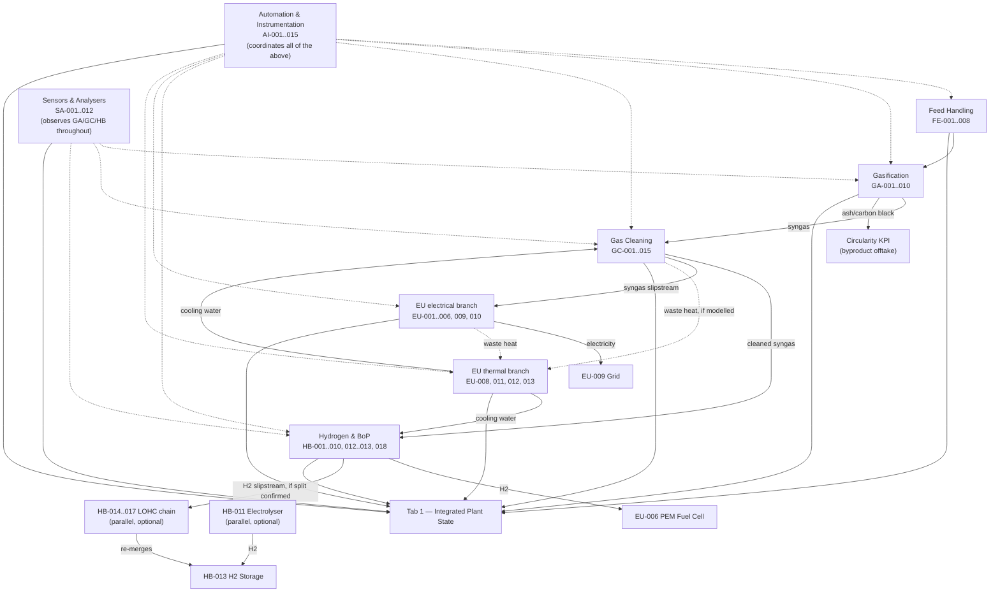

# HYGAS-AI Digital Twin — Engineering Plan for an Online, Physics-Based Simulation

**Status: PLANNING ONLY. No code in this repo is changed by this document.**

This document is the deliverable for a single task: analyze the existing HYGAS-AI
codebase honestly, then design — at a blueprint level, not an implementation level —
how it could evolve from a **static design-data registry with an isolated physics
demo** into a **coordinated, online engineering simulation** where every tab produces
real operational results from real equipment models, those models interact through
the actual process dependencies, and Tab 1 (currently "Digital Twin Status") becomes
the genuine integrated output of that coordination rather than a grab-bag of 20
unrelated sections.

**The one rule that governs every section below, restated because it is the point of
the whole exercise:** every proposed calculated output must trace as
`Input → Model → Equation/Correlation → Output`, or it is explicitly marked
`Missing / Cannot Calculate`. Where Step 1/2 analysis below finds no honest path to a
real model for an equipment type, this document says so directly, names the reason,
and does not propose a fabricated substitute. A partially modeled, technically
defensible twin is the goal — not a visually complete one built on invented numbers.

## How to read this document against the task's 18 points

The task's Step 2/3 asked for 11 facets (Tab, equipment item, model type, inputs,
data status, equations, outputs, states, dependencies, tab-level results, readiness)
to be documented for every one of the 91 items and 9 tabs. Those 11 facets are not
11 separate top-level sections — they are the **columns of one combined per-item,
per-tab analysis**, which is what Section 2 below actually is. The full numbered
mapping:

| Task point | Where it is covered |
|---|---|
| 1. Existing architecture | Section 1 |
| 2. Tab/subsystem | Section 2 (organized by tab) |
| 3. Equipment item | Section 2 (one row per item, in per-tab tables) |
| 4. Engineering/physics/logic model | Section 2, "Model type" column + prose |
| 5. Inputs | Section 2, "Inputs" column |
| 6. Confirmed/Estimate/Missing | Section 2, "C/E/M" column (from the live registry) |
| 7. Equations/correlations | Section 2, prose under each tab, and Section 2.9 (equation index) |
| 8. Calculated outputs | Section 2, "Outputs → feeds" column |
| 9. Operational states | Section 2, "State" column + Section 3 per-tab state machines |
| 10. Upstream/downstream dependencies | Section 2 dependency notes + Section 4 (process flow map) |
| 11. Tab-level operational results | Section 3 |
| 12. Modeling readiness/confidence | Section 2, "Tier/Confidence" column + Section 5 |
| 13. Implementation priority tiers | Section 5 |
| 14. Central online simulation architecture | Section 6 |
| 15. Integrated Tab 1 architecture | Section 7 |
| 16. Future sensor/PLC integration | Section 8 |
| 17. Validation requirements | Section 9 |
| 18. Engineering limitations and unresolved questions | Section 10 |

Traceability/data-status classification (Measured/Calculated/Estimated/Assumed/
Missing) is threaded through Sections 2, 6, and 8 rather than isolated in one place,
since the task requires it to exist at the equipment, tab, AND system level
simultaneously — a single section couldn't honestly show that without duplicating
the whole document.

---

## Section 1 — Existing architecture: what actually exists today

This section is deliberately skeptical, per the task's explicit instruction not to
assume the current architecture is complete or correct. It is based on reading every
one of the 33 files in `python/`, all ~2,200 lines of `app.py`, `data/
equipment_registry.json`'s structure, and the module import list at the top of
`app.py` (the ground truth for what is actually wired into the running app — an
unimported module is dead code for this purpose, however complete it is on its own).

### 1.1 The three things this app actually is, layered but NOT integrated

Reading `app.py` top to bottom reveals it is really **three separate applications
sharing one Streamlit page**, not one coherent system:

**(A) A physics demo, living entirely inside Tab 1.** Four real, validated,
steady-state physics/optimization modules — `kinetics.py` (WGS reaction kinetics,
HTS+LTS), `psa.py` (PSA H2 recovery), `chp.py` (CHP part-load efficiency curves),
`dispatch_ga.py` (genetic-algorithm CHP dispatch) — plus 19 "innovation modules"
built on top of them (`uncertainty.py`, `optimizer.py`, `predictive_maintenance.py`,
`copilot.py`, `vendor_log.py`, `compliance.py`, `regulatory_drafting.py`,
`multi_agent_negotiation.py`, `confirmation_loop.py`, `circularity.py`,
`multi_module_orchestration.py`, `novelty_audit.py`, `safety_flags.py`,
`pinn_kinetics.py`, `sim_to_real.py`, `federated_learning.py`,
`performance_guarantee.py`, `time_series_sim.py`, `tda_analysis.py`) are all rendered
as 20 sequential `st.header()` sections inside Tab 1 (`app.py:29-1507`, ~1,480 lines —
by far the largest tab). **Every one of these takes its operating point from
Streamlit sliders the user drags**, not from the equipment registry. There is no
gasifier model, so `kinetics.py`'s default inlet CO fraction (`y_CO_in=0.28`) is a
hardcoded design assumption, not a live upstream calculation. `dispatch_ga.py`'s
"syngas fuel budget (kW)" is a slider, not a real flow computed from GC-013's
confirmed gas flow and an LHV.

**(B) A static design-data registry, living in Tabs 3-9.** `equipment_datasheet.py`
reads `data/equipment_registry.json` (91 real DOK-ING equipment items, extracted
once from an Excel workbook) and sorts each item's real parameters into six fixed
categories (Inputs, Outputs, Parameters, Measurements, Operating Conditions,
Performance Indicators) by a keyword rule on the parameter's own name text.
`equipment_rfi_fills.py` and `equipment_engineering_estimates.py` layer two more
kinds of value on top — real DOK-ING RFI answers, and this project's own
literature/correlation-based engineering estimates — each tagged with an honest
status (`Confirmed` / `Engineering Estimate` / `Missing Data — Required`). This is a
**pure read/display/classify pipeline**. It computes nothing. An item's "Outputs"
value is whatever string sits in that row of the JSON file (or an estimate derived
by hand and hardcoded into `ESTIMATE_FILLS`) — it is never the result of applying a
model to that item's own Inputs. GC-007's tar removal efficiency, for instance, is a
single static number in `ESTIMATE_FILLS`, computed once by a human doing arithmetic
in a docstring — not a live function of GC-006's actual outlet tar concentration.

**(C) A project-management/documentation layer, spread across Tab 1's tail end and
Tab 2.** `design_basis.py` (17 DOK-ING RFI questions, project-level, e.g. "what's the
feed rate"), `vendor_log.py`, `equipment_data_requests.py` +
`equipment_request_routing.py` (auto-generated gap lists), `novelty_audit.py`
(code-coverage self-audit). These track what is known/unknown about the *project*,
not the *plant's operating state*.

**These three layers do not talk to each other.** Confirmed at the code level, not
assumed: nothing in `python/equipment_datasheet.py`, `equipment_rfi_fills.py`, or
`equipment_engineering_estimates.py` imports `kinetics.py`, `psa.py`, `chp.py`, or
any of the 19 innovation modules, or vice versa. The one narrow exception —
`safety_flags.py` reads `equipment_registry.load_registry()` directly to pull HB-013's
design pressure and the ATEX-rated item list — is a read of static registry text, not
a live equipment model output. `novelty_audit.py`'s own `EVIDENCE_RECORDS` (see 1.3
below) is the only place in this codebase that explicitly maps which of the 91
registry items have ANY code behind them at all, and it exists specifically because
that mapping is otherwise invisible.

### 1.2 Data flow today: none, between the two halves

There is currently **zero automatic data flow** between the equipment registry
(Tabs 3-9) and the physics core (Tab 1). Concretely:

- GC-013 (Gas Blower/ID Fan)'s own confirmed design gas flow (50 Nm³/h) never reaches
  `dispatch_ga.py`'s "syngas fuel budget" slider — that slider defaults to 60 kW,
  a number nobody derived from GC-013's flow and a syngas LHV.
- HB-002's confirmed HTS steam-to-CO ratio and GHSV parameters sit in the equipment
  datasheet as inert display text; `kinetics.py`'s `hts_conversion()` has its own
  independent default arguments (`steam_to_CO=4.0`, `GHSV=2000`) that happen to
  match by construction (the registry values were written to describe the same
  design point), not because one reads the other.
- HB-013's confirmed 875 bar(g) design pressure is read once by `safety_flags.py` for
  a hazard-reference comparison; there is no H2 storage **inventory** model anywhere
  — no code answers "how much H2 is in the tank right now."
- `equipment_engineering_estimates.py`'s GC-006/GC-012 gas-flow fills (both ~50 Nm³/h)
  were computed **once, by a human, interpolating between two other static registry
  values** — not by a model that would recompute automatically if the upstream flow
  changed.

The one and only place any process-level chaining exists between subsystems, and it
is entirely inside Tab 1's physics demo, not the registry: `uncertainty.py`'s Monte
Carlo feeds `kinetics.hts_conversion()`'s output into `kinetics.lts_conversion()`'s
input (the LTS stage's inlet CO fraction is the HTS stage's outlet), and
`optimizer.py`, `predictive_maintenance.py`, `root_cause.py`, `time_series_sim.py`,
`tda_analysis.py`, `sim_to_real.py`, `federated_learning.py`, `pinn_kinetics.py` all
build on that same two-stage WGS chain plus PSA. That is real, working chaining — but
it is confined to two equipment items' worth of physics (HB-001/002/004 for WGS,
HB-006/007/008 for PSA) out of 91, and it starts from slider values, not from a
gasifier or gas-cleaning model that doesn't exist.

### 1.3 What already has real code behind it — the honest starting point

`novelty_audit.py`'s own `EVIDENCE_RECORDS` (read directly, not inferred) is the
authoritative, code-verified answer to "which equipment items have real code behind
them today." Cross-checked against every module's own source:

| Equipment IDs | Real code | What it computes |
|---|---|---|
| HB-001, HB-002, HB-004 (WGS HTS/LTS reactors) | `kinetics.py` | HTS/LTS CO conversion via Arrhenius/Van't Hoff ODE integration, validated to reproduce the stated 75.0%/40.0%/85.0% design targets exactly |
| HB-006, HB-007, HB-008 (PSA unit) | `psa.py` | H2 recovery via a selectivity + pressure-ratio correlation, validated to reproduce the stated 75.0% target exactly |
| EU-001..EU-006 (CHP: SOFC, Gas Engine, Microturbine, PEM FC) | `chp.py`, `dispatch_ga.py` | Part-load efficiency curves (all four reduce exactly to their rated efficiency at full load) and fuel-constrained dispatch optimization |
| GA-005, GA-008, GA-009 (ash/carbon-black byproducts) | `gasifier_mass_balance.py`, `circularity.py` | Linear mass-balance byproduct flow, ported from the registry's own stated design fractions (10% ash, 5% carbon black, dry-feed basis) |
| AI-012 (AI Model Server) | `optimizer.py` | Setpoint search over WGS/PSA operating points — this repo's own real, if limited, MPC/RL-adjacent function |
| AI-014 (Orchestration Controller) | `multi_module_orchestration.py` | Coordinates hypothetical parallel WGS trains — a real algorithm, run on illustrative (not this-plant-real) module counts |
| AI-015 (RFNBO Compliance Monitor) | `compliance.py`, `regulatory_drafting.py`, `confirmation_loop.py` | RFNBO-readiness checklist and draft generation from live physics/assumption state |

**That is 18 of 91 equipment items (19.8%) with any functional code behind them at
all, all of it concentrated in three equipment clusters (WGS, PSA, CHP) plus three
AI-tab items whose "equipment" is really a description of the codebase's own control/
compliance software. The other 73 items (80.2%) — the entire gasifier, the entire
15-item gas-cleaning train, all 12 sensors/analysers, most of Hydrogen & BoP (H2
storage, compression, membrane separation, the LOHC chain, the electrolyser), most of
Electrical & Utilities (flare, cooling tower, grid metering, UPS, district heat), and
12 of the 15 Automation & Instrumentation items — have real registry DATA but zero
operational MODEL.** This is the single most important finding of Step 1: the
"physics core" this task is asked to extend is a real but narrow foundation covering
about a fifth of the plant, concentrated almost entirely in the hydrogen-purification
back end, not the front end. The gasifier itself — the one piece of equipment
everything else depends on — has no model of any kind, physics or otherwise;
`gasifier_mass_balance.py`'s own docstring says so explicitly ("no gasifier module at
all yet ... the gasifier itself isn't implemented in either language"), and that
statement is still true.

### 1.4 The `design_basis.py` / `confirmation_loop.py` promotion pattern, generalized

One existing pattern IS worth reusing wholesale, because it already solves a problem
this plan needs solved: **"assumed by default, replaced by a real confirmed value
the moment one exists, with every downstream consumer picking it up automatically."**
`uncertainty.py` holds six design assumptions as a `point ± fraction` default;
`confirmation_loop.py.record_confirmation()` calls `uncertainty.set_confirmed()`,
which flips `ASSUMPTIONS[key]["confirmed_low"/"confirmed_high"]` in place; every
consumer (`uncertainty.bounds()`, `run_monte_carlo()`, `compliance.py`'s checklist
status, `safety_flags.h2s_feed_flags()`) reads that same live dict, so nothing needs
telling twice. `confirmation_loop.sync_confirmed_from_db()` replays Supabase's
durable record into that in-memory state on every fresh process start.

This is architecturally identical to what Section 8 below needs for real sensor/PLC
values eventually replacing simulated ones — the same "one live source of truth,
many readers, an explicit promotion step" shape, just generalized from six named
design assumptions to every operational variable in the plant. Section 6 and Section
8 build directly on this precedent rather than inventing a new pattern.

### 1.5 The registry's own section ordering is NOT a strict linear process flow

The task's own Step 2 prompt suggests treating FE→GA→GC→SA→HB→EU→AI as the process
flow. Checked directly against every item's own name and remarks (not assumed): five
of the seven sections genuinely are sequential process stages, and two are not.

- **FE (Feed Handling) → GA (Gasification) → GC (Gas Cleaning) → HB (Hydrogen &
  BoP)** is real and sequential: feed preparation, into the gasifier, through gas
  cleaning, through WGS/PSA to storage/end-use. This is the backbone.
- **SA (Sensors & Analysers) is not a process stage — it is a parallel,
  cross-cutting instrumentation layer.** Its 12 items are measurement POINTS
  physically located at specific points along the FE→GA→GC→HB backbone (SA-007's tar
  port near GC-006, SA-008's H2S/COS analyser near GC-008/GC-012, SA-009's dust
  monitor near GC-010, SA-010's clean-gas flow meter near GC-013), not a stage
  material passes through in sequence.
- **EU (Electrical & Utilities) is not one downstream stage either — it is two
  parallel utility branches feeding INTO and drawing FROM the main chain simultaneously:
  an electrical branch (EU-003/EU-005 CHP generation using cleaned syngas as fuel,
  EU-006 PEM fuel cell using pure H2, EU-009 grid interconnection, EU-010 UPS) and a
  thermal branch (EU-008 cooling tower supplying cooling water to GC-004/005, HB-003,
  HB-012; EU-011/012/013 recovering and metering waste heat for district heating).**
  Critically, `dispatch_ga.py`'s own `FUEL_TYPE` mapping (checked in code, not
  assumed) shows SOFC/Gas Engine/Microturbine burn **syngas** (a slipstream of
  cleaned gas, upstream of WGS) while only the PEM Fuel Cell burns **H2** (the WGS+PSA
  product) — so EU is not "after HB" in a simple line, it taps the process at two
  different points.
- **AI (Automation & Instrumentation) is not a process stage at all — it is the
  plant's own control/data backbone**, superimposed over every other section. This
  has a specific, useful consequence for Section 6/7 below: several AI items are not
  "equipment to model" in the same sense as a pump or a scrubber — they are
  descriptions, from the equipment-registry's point of view, of the very
  update-cycle/state-machine/integration architecture this plan is designing. AI-004
  (PLC) is the state-machine executor; AI-011 (Time-Series Database) is where
  operational history belongs; AI-012 (AI Model Server) already IS `optimizer.py`;
  AI-013 (Digital Twin Engine) is, almost by definition, what Section 7's "Tab 1"
  design describes from the opposite direction. This identity is not a coincidence to
  paper over — Section 6/7 name it explicitly.
- **HB-011 (Electrolyser) is a parallel, optional green-H2 path**, not a continuation
  of HB-001..010 — it feeds the SAME shared H2 storage (HB-013) that the primary
  WGS+PSA route feeds, using renewable electricity and water rather than syngas.
- **HB-014..017 (the LOHC chain) is a parallel, optional H2 storage-and-release
  pathway**, an alternative to direct compressed storage (HB-012/013) for part of the
  H2 stream, which the item's own registry remarks confirm re-merges with the primary
  route at the same shared storage.

The real topology (used throughout Section 2 and formalized in Section 4) is a
**backbone with two parallel input branches (HB-011 electrolyser; HB-014-017 LOHC) and
two parallel output/utility branches (EU electrical; EU thermal), instrumented
throughout by SA, and coordinated throughout by AI** — not seven equal, sequential
boxes.

### 1.6 Summary: what this plan is actually being asked to build

Given the above, "extend the physics core to all 91 items" is really three distinct
engineering efforts, not one:

1. **Build the missing physics/engineering-calculation models** for the ~55 process
   equipment items (FE, GA, GC, most of HB, most of EU) that have real registry data
   but no code — the gap Section 2/5 addresses.
2. **Wire the existing and new models together** into one coherent update cycle that
   respects the real topology in 1.5, replacing today's independent sliders with
   values that actually propagate — Section 6.
3. **Give the ~30 pure-instrumentation/automation items (SA + most of AI) an honest,
   different kind of representation** — not a physics model, but a live
   measurement-representation/state-machine layer that reads the process models'
   outputs and reports them the way a real sensor/PLC/SCADA stack would — Section 2.6,
   2.10, and 8.

---

## Section 2 — Equipment-level analysis, all 91 items, organized by tab

**How to read the tables below.** Each row is one registry item. Columns:

- **C/E/M** — the item's CURRENT six-category status, read live from
  `equipment_datasheet.slot_status()` after both overlays
  (`equipment_rfi_fills.py` + `equipment_engineering_estimates.py`) are applied — the
  exact same computation the running app itself displays. Order is fixed:
  **Inputs-Outputs-Parameters-Measurements-OperatingConditions-PerformanceIndicators**.
  `C`=Confirmed, `E`=Engineering Estimate, `M`=Missing. This is EXISTING data, not
  something this plan proposes — it establishes the honest starting point for what a
  model would have to work with.
- **Model type** — one of four, never blended: **Physics** (a real governing equation —
  ODE, thermodynamic/mass-transfer correlation — the same class as `kinetics.py`),
  **Engineering calc** (a standard, named, citable engineering correlation or mass/
  energy balance — the same class as a heat-exchanger effectiveness-NTU calculation
  or a compressor polytropic-work equation; less fundamental than a Physics model but
  just as real and just as traceable), **Logic/state** (a rule-based state machine or
  pass-through relationship — no continuous equation, e.g. "Outputs = Inputs" for a
  conveyor, or "state = RUNNING if upstream flow > 0"), or **Not modelable** (named
  honestly, with the specific missing prerequisite stated).
- **Tier** — the implementation priority tier from Section 5 (T1-T5).
- **Outputs → feeds** — which downstream item(s) would consume this item's calculated
  output, establishing the dependency graph Section 4/6 formalizes.

Every equation named below is a real, standard, citable engineering relationship — no
row states an equation this plan cannot also state where it comes from. Where no
defensible equation exists, the row says `Not modelable` and states why, per the
task's non-negotiable rule.

### 2.1 Feed Handling (FE-001..FE-008) — Tab "Feed Handling"

The real front end of the plant: receive MSW, remove tramp metal, weigh, shred, dry,
verify moisture, and meter it into the gasifier. This is a genuinely tractable
mass/energy-balance chain — every step's Outputs = a function of its own Inputs, and
almost every needed input is already Confirmed in the registry.

| ID | Name | C/E/M | Model type | Key inputs | Equation/basis | Outputs → feeds | Tier |
|---|---|---|---|---|---|---|---|
| FE-001 | MSW Receiving Hopper | C-M-C-C-C-M | Engineering calc | Confirmed hopper capacity (2 t / 1.7 t usable), confirmed discharge opening, downstream draw rate (FE-003) | Inventory mass balance: `level(t+dt) = level(t) + inflow·dt − outflow(FE-003)·dt`, clamped to [0, 1.7 t] | Feedstock buffer level → gates FE-003's state (starved if level=0) | T3 |
| FE-002 | Magnetic & Eddy Current Separator | C-M-C-M-E-C | Logic/state (mass pass-through) + **Not modelable** for reject rate | FE-001 outflow | Mass out ≈ mass in (already-established recategorization finding: no distinct Outputs concept). Reject/tramp-metal mass fraction: **not modelable** — needs a feedstock tramp-metal content this project has no source for (already declined in `equipment_engineering_estimates.py` for the identical reason) | Feed mass (unchanged) → FE-003 | T3 |
| FE-003 | Weighing Conveyor | C-M-C-C-E-M | Logic/state (pass-through + measurement) | FE-002 outflow | Mass out = mass in (own confirmed "Nominal feed rate" IS both). This is the plant's real feed-rate SETPOINT/measurement point | Feed rate (kg/h) → FE-004, and → GA-001 as the gasifier's dry-feed-equivalent input | T3 |
| FE-004 | Shredder / Size Reducer | C-C-C-M-E-E | Logic/state (pass-through) + Engineering calc (power) | FE-003 feed rate; confirmed drive motor power | Mass out = mass in (no chemical change). Specific energy = motor power / throughput (already exact-calculated: 150 kWh/tonne) | Shredded feed mass (unchanged) → FE-005; specific-energy KPI → Tab-level Feed Handling KPI | T3 |
| FE-005 | Feed Dryer (Rotary/Belt) | C-C-C-M-C-E | **Engineering calc** | FE-004 outflow; confirmed inlet moisture (10%) and outlet moisture target (<1%) | Moisture mass balance (the same relationship FE-007's existing static fill used, made LIVE): dry-solids mass = feed × (1 − moisture_in); outlet wet mass = dry-solids mass / (1 − moisture_out); evaporation load = feed − outlet wet mass | Post-drying feed mass, evaporation duty (kg/h water, a real thermal-utility demand) → FE-006, FE-007, and → EU thermal balance as a heat consumer | T3 |
| FE-006 | Moisture Analyser | M-M-C-C-C-M | Logic/state (measurement representation) | FE-005's calculated outlet moisture | Virtual sensor: reads FE-005's own model output, reports it as "Calculated (would be Measured once a real analyser is installed)" | Moisture reading → operator display, → FE-007 as a control input in a real plant (not simulated here) | T4 |
| FE-007 | Feed Screw / Ram Feeder | C-E-C-C-C-M | Logic/state (pass-through) | FE-005 outflow | Mass out = mass in (this item's own existing Outputs fill already establishes this figure; making it live means it recomputes from FE-005's live output instead of a hardcoded 37.9 kg/h) | Dried feed mass → FE-008 | T3 |
| FE-008 | Air-lock / Rotary Valve | C-E-C-M-C-M | Logic/state (pass-through + seal state) | FE-007 outflow | Mass out = mass in; a real airlock also has a discrete cycle state (OPEN/SEALED) — modelable as a simple duty-cycle state, not a continuous equation | Dried feed mass → **GA-001 (Gasifier) as its real Inputs** | T3 |

**Tab-level Feed Handling result this section can genuinely produce:** a live
feedstock mass-balance chain from hopper to gasifier inlet — final feed rate,
moisture content, specific shredding energy, drying thermal duty, and hopper buffer
level — every one of them a real number derived from the confirmed FE-001..FE-008
data, not re-estimated per item. This is one of the strongest candidates in the whole
registry for a fully-live tab, because unlike the gasifier or gas-cleaning train, no
new physics needs inventing here — only genuine mass-balance sequencing of numbers
that are almost entirely already Confirmed.

### 2.2 Gasification (GA-001..GA-010) — Tab "Gasification"

This is the hardest and most consequential gap in the whole registry: **the gasifier
itself has no gas-phase model anywhere in this codebase.**
`gasifier_mass_balance.py`'s own docstring says so, and it is still true — that
module covers only the SOLID byproduct split (ash, carbon black), a linear mass
fraction ported from the registry's own stated design numbers, not a reaction model.
Nothing computes syngas composition (H2/CO/CO2/CH4/tar/H2O/N2 mole fractions) or
syngas yield (Nm³ per kg feed) from feed composition and gasifier operating
conditions — and every single downstream item in GC and HB depends on exactly that
number. This is Section 5's #1 priority for exactly this reason.

| ID | Name | C/E/M | Model type | Key inputs | Equation/basis | Outputs → feeds | Tier |
|---|---|---|---|---|---|---|---|
| GA-001 | Gasifier Vessel (Reactor) | C-M-C-C-C-C | **Engineering calc** (new — the critical gap) | FE-008 dry feed rate; GA-003/004 air+steam flow/temp; an assumed/literature carbon-conversion efficiency and a stoichiometric or simplified-equilibrium product-gas model | A real, citable, but NOT-yet-built model: air-blown/steam gasification stoichiometry with an assumed carbon-conversion efficiency (literature range, e.g. Basu, *Biomass Gasification, Pyrolysis and Torrefaction*) combined with a simplified thermodynamic-equilibrium or empirical yield correlation for H2/CO/CO2/CH4 split as a function of equivalence ratio (ER, already used elsewhere in this project at 0.25) and temperature. **Honestly flagged: this model would have no in-project calibration point the way `kinetics.py`/`psa.py` have a stated design target to reproduce exactly — it would be a literature-grounded estimate, not a validated design match, until DOK-ING provides real gasifier performance data.** | Syngas flow (Nm³/h) + composition (H2/CO/CO2/CH4/tar/H2O mole %) → **GC-001 (first item with a real gas stream to clean)**; char/ash split → GA-005 | T1 (highest priority, hardest lift) |
| GA-002 | Gasifier Vessel (Pressure) | M-M-C-C-C-M | Logic/state (shared-equipment sub-item) | GA-001's operating pressure | No distinct model — this is the pressure/instrumentation aspect of the SAME physical vessel GA-001 already covers (established shared-equipment pattern, same as GC-002/GC-014 etc.) | Bed pressure (feeds AI-003's virtual sensor reading) | T4 |
| GA-003 | Air/Steam Injection (Flow) | C-M-C-C-M-M | Logic/state (pass-through) | Confirmed air/steam design flow, ER=0.25 | Flow delivered = flow set (this is an operator/control setpoint, not a computed quantity) | Air+steam flow → GA-001 as a real reactant input | T3 |
| GA-004 | Air/Steam Injection (Temp) | M-M-C-C-M-M | Logic/state (shared-equipment sub-item) | GA-003's own confirmed temperature setpoints | Same shared-equipment reasoning as GA-002 | Air/steam temperature → GA-001 | T4 |
| GA-005 | Bed Drain / Ash Discharge System | C-C-C-C-E-M | **Engineering calc** (already ported) | GA-001's dry feed rate | `gasifier_mass_balance.byproduct_mass_flows()`: ash = feed × 0.10 (already real code, currently a standalone function — the integration work is calling it FROM a live GA-001 feed rate instead of a hardcoded default) | Ash mass flow → GA-006 | T1 (integration only) |
| GA-006 | Char / Ash Conveyor | C-E-C-C-E-M | Logic/state (pass-through) | GA-005 outflow | Mass out = mass in | Ash mass flow → GA-007 | T3 |
| GA-007 | Char Collection Bin | E-E-C-C-M-M | Engineering calc (buffer inventory) | GA-006 outflow | Same inventory-level pattern as FE-001 | Ash buffer level; ash outflow → GA-008/GA-009 | T3 |
| GA-008 | Carbon Black Recovery & Classification Unit | E-C-C-M-C-C | **Engineering calc** (already ported) | GA-001's dry feed rate; confirmed >95% collection efficiency | `byproduct_mass_flows()`: carbon black = feed × 0.05; recovered = raw × 0.95 (already established, currently static) | Recovered carbon black mass → GA-010 | T1 (integration only) |
| GA-009 | Ash Aggregate Processing & Packaging Unit | C-C-C-M-E-E | Engineering calc (already established) | GA-007 ash outflow; confirmed 5-10% Portland-cement additive | Product mass = ash mass × (1 + additive fraction) | Aggregate product mass → Tab-level Circularity KPI (already `circularity.py`'s role, made live) | T2 |
| GA-010 | Carbon Black Packaging & Storage Silo | E-C-C-M-E-M | Engineering calc (buffer inventory) | GA-008 recovered mass | Same inventory pattern as GA-007/FE-001 | Silo buffer level → Tab-level Circularity KPI | T2 |

**Tab-level Gasification result this section can genuinely produce, once GA-001's
syngas model exists:** syngas flow and composition, char/ash and carbon-black mass
splits (already real), gasifier operating state. **Until GA-001's model is built,
this tab's live results are limited to the solid-byproduct chain (already real via
`gasifier_mass_balance.py`) — the gas-phase side stays honestly `Missing / Cannot
Calculate` in Tab 1, and every downstream GC/HB item that needs a real syngas
composition inherits that same honest gap rather than being given an invented feed.**

### 2.3 Gas Cleaning (GC-001..GC-015) — Tab "Gas Cleaning"

The train that takes raw gasifier product gas to WGS-ready cleaned syngas: two
cyclones, a quench tower, a tar-removal adsorber, three wet scrubbers (tar/H2S/HCl),
a bag filter, an activated-carbon polish, and a blower. This is the section with the
**best ratio of real, standard, citable engineering correlations to registry data
already on file** — every removal step has a real textbook treatment, and several
already have exact-calculation precedent in `equipment_engineering_estimates.py`
(GC-007/GC-010's efficiency = (inlet−outlet)/inlet). The genuinely new work is turning
those one-off static calculations into a live chain where each stage's OUTLET
concentration becomes the NEXT stage's INLET concentration automatically.

| ID | Name | C/E/M | Model type | Key inputs | Equation/basis | Outputs → feeds | Tier |
|---|---|---|---|---|---|---|---|
| GC-001 | Primary Cyclone (Temp) | C-M-C-C-M-M | **Engineering calc** | GA-001 syngas flow + particulate loading | Standard cyclone grade-efficiency correlation (Lapple/Rosin-Rammler-type cut-diameter model — a real, textbook, citable method, e.g. Perry's Chemical Engineers' Handbook) | Particulate-reduced gas → GC-003; collected dust → solids handling | T1 |
| GC-002 | Primary Cyclone (ΔP) | M-M-C-C-C-C | Logic/state (shared-equipment sub-item of GC-001) | GC-001's gas flow | Standard cyclone pressure-drop correlation (Shepherd-Lapple, or an equivalent citable method) — a genuine ΔP calculation, distinct enough from GC-001's efficiency to be its own row | Pressure drop (feeds AI-003's virtual sensor reading, per that item's own confirmed connection to GA-002/GC-002-style taps) | T1 |
| GC-003 | Secondary Cyclone | C-M-C-M-M-C | **Engineering calc** | GC-001 outlet gas + residual particulate | Same cyclone correlation as GC-001, sized for the finer residual cut | Further particulate-reduced gas → GC-004 | T1 |
| GC-004 | Quench Tower (Temp) | C-M-C-C-M-M | **Engineering calc** | GC-003 outlet gas temperature/flow; confirmed quench outlet target (~65°C from ~860°C) | Adiabatic gas-cooling/water-evaporation energy balance (a real psychrometric-style calculation) — **honestly flagged: this needs an assumed inlet water-vapor content this project does not have confirmed**, the exact gap `equipment_engineering_estimates.py`'s GC-004 decline already identified; the live model can still compute sensible-heat cooling duty and quench-water flow from the confirmed temperature drop, leaving only the "~70% gas-volume contraction" claim unconfirmed rather than blocking the whole calculation | Cooled, quenched gas → GC-006; condensate → GC-015 | T1 |
| GC-005 | Quench Tower (Water) | M-M-C-C-C-M | Logic/state (shared-equipment sub-item of GC-004) | GC-004's cooling duty | Water balance: quench-water flow from confirmed consumption/blowdown rates | Blowdown → GC-015; cooling-water demand → EU-008 (Cooling Tower) as a real utility consumer | T1 |
| GC-006 | Tar Removal Unit | E-E-C-M-C-M | **Engineering calc** | GC-004 outlet gas + tar concentration | Removal-efficiency correlation from literature (dry packed-bed tar adsorption) applied to an actual upstream tar concentration, once GA-001 provides one — TODAY this item's Inputs/Outputs are a static ~50 Nm³/h interpolation; the live version replaces that interpolation with GC-004's real flow | Tar-reduced gas → GC-007 | T1 |
| GC-007 | Wet Scrubber (Tar) | C-C-C-C-C-E | **Engineering calc** (exact-calc precedent exists) | GC-006 outlet tar concentration; confirmed inlet/outlet design figures | Efficiency = (inlet − outlet)/inlet, ALREADY the exact pattern used for the current static 90% fill — made live means it applies to GC-006's real outlet, not a fixed inlet number | Further tar-reduced gas → GC-008 | T1 |
| GC-008 | Wet Scrubber (H₂S) | C-C-C-C-E-C | **Engineering calc** | GC-007 outlet + confirmed H2S removal target (>99.5%, <1 ppm) | Same efficiency-based removal calc; this is the item `safety_flags.py` already names as the "hard protection requirement" for LTS catalyst poisoning — the live model makes that protection a real computed margin, not just a cited target | H2S-reduced gas → GC-009; and a live outlet H2S ppm value feeds `safety_flags.py`'s catalyst-risk check directly instead of the static assumption it uses today | T1 |
| GC-009 | HCl Scrubber (Alkaline) | C-C-C-M-C-C | **Engineering calc** | GC-008 outlet + confirmed HCl removal target (<5 ppm) | Same efficiency-based removal calc | HCl-reduced, sequentially-cooled gas → GC-010 | T1 |
| GC-010 | Bag Filter (Dust) | C-C-C-C-C-E | **Engineering calc** (exact-calc precedent exists) | GC-009 outlet dust loading | Efficiency = (inlet−outlet)/inlet — same pattern as GC-007, already the current static 98.3% fill's basis | Dust-reduced gas → GC-012 | T1 |
| GC-011 | Bag Filter (ΔP) | M-M-C-C-C-M | Logic/state (shared-equipment sub-item of GC-010) | GC-010's gas flow + dust loading | Standard baghouse pressure-drop correlation (function of face velocity + dust cake buildup — a citable, standard filtration-engineering relationship) | Pressure drop (feeds AI-003-style virtual sensing, and a real "time to next cleaning cycle" state) | T1 |
| GC-012 | Activated Carbon Filter | E-E-C-C-C-M | **Engineering calc** | GC-010 outlet H2S/COS residual | Same removal-efficiency pattern as GC-007/GC-010, applied to the polishing target (<0.1 ppm) | Polished gas → GC-013 | T1 |
| GC-013 | Gas Blower / ID Fan (Flow) | C-M-C-C-M-M | **Engineering calc** | GC-012 outlet gas flow; confirmed blower design flow/pressure rise | Fan/blower power: `P = ΔP·Q/η` (standard fan-affinity/power equation) | Cleaned syngas flow → **HB-001/002 (WGS) as its real Inputs**, and → EU-003/004/005 (CHP suite) as a fuel-gas slipstream, per the real FUEL_TYPE topology in Section 1.5 | T1 |
| GC-014 | Gas Blower (Pressure) | M-M-C-C-M-M | Logic/state (shared-equipment sub-item of GC-013) | GC-013's own flow/pressure | Same shared-equipment reasoning as GC-002/GC-011 | Discharge pressure (feeds virtual sensing) | T1 |
| GC-015 | Condensate Tank | C-M-C-C-M-M | **Engineering calc** | GC-004/005 quench blowdown + GC-007/008/009 scrubber blowdowns | Mass-balance summation of confirmed blowdown streams (the exact chain the pre-existing mislabeled-reference finding in `equipment_engineering_estimates.py`'s docstring already identified as the intended, if mis-cited, sources) | Condensate outflow → water-treatment/discharge (outside this project's current scope) | T2 |

**Tab-level Gas Cleaning result this section can genuinely produce, once GA-001
provides a real syngas composition:** a fully live, stage-by-stage cleaned-gas
composition trace (particulate, tar, H2S, HCl, dust each falling through their own
real removal step), final cleaned-syngas flow/composition/temperature ready for WGS,
and every scrubber's real-time removal margin against its protection target
(directly strengthening `safety_flags.py`'s catalyst-risk check with a live number
instead of a static assumption). This is the section where the "equipment interacting
through real process dependencies" requirement is most concretely demonstrable: a
change in GC-006's tar removal performance visibly changes GC-007's inlet, which
changes GC-007's own removal margin, all the way through to HB-004's sulfur exposure.

### 2.4 Sensors & Analysers (SA-001..SA-012) — Tab "Sensors & Analysers"

**None of these 12 items get a physics or engineering-calculation model — and that is
the correct, honest outcome, not a shortfall.** Every one of them is a measurement
INSTRUMENT, not process equipment: it observes a property of the shared gas stream at
one point in the FE→GA→GC→HB backbone; it does not receive, transform, or produce a
material or energy stream of its own. This was already established, item by item,
during the engineering-estimate work (`equipment_engineering_estimates.py`'s SA
REPORT) — this plan does not revisit that conclusion, it gives it an architectural
role instead of leaving it a dead end.

**The one genuine thing this plan can do for SA that today's static registry cannot:
turn each instrument into a live "virtual sensor" that reads the real upstream/
downstream process model's calculated value at its own physical location and reports
it as that model's output, honestly labeled `Calculated (would be Measured once a
real instrument is installed)`.** This is a **Logic/state, measurement-representation
model** — not a physics model of the instrument itself (that would require real
sensor-response physics this project has no basis for) — but it is a genuine,
non-fabricated way to give SA operational results:

| ID | Name | C/E/M | What it would virtually read | Physical location (own registry data) |
|---|---|---|---|---|
| SA-001 | Gas Analyser (H₂) | M-M-C-C-M-M | The cleaned-syngas or post-WGS/PSA H2 composition, once GC/HB models exist | Confirmed sample-conditioned, downstream of gas cleaning |
| SA-002 | Gas Analyser (CO) | M-M-C-C-M-M | Same location's calculated CO composition | Same |
| SA-003 | Gas Analyser (CO₂) | M-M-C-C-M-M | Same location's calculated CO2 composition | Same |
| SA-004 | Gas Analyser (CH₄) | M-M-C-C-M-M | Same location's calculated CH4 composition | Same |
| SA-005 | Gas Analyser (N₂) | M-M-C-C-M-M | Same location's calculated N2 composition | Same |
| SA-006 | Gas Calorimeter / LHV | M-M-C-C-M-M | A calculated LHV from the same composition (a real, standard LHV-from-composition correlation, e.g. weighted heating values of H2/CO/CH4) | Same location as SA-001..005 |
| SA-007 | Tar Sampling Port | M-M-C-M-M-M | GC-006's calculated tar concentration | Upstream of GC-006 (own remark, corrected per the mislabel finding in `equipment_engineering_estimates.py`) |
| SA-008 | H₂S / COS Analyser | M-M-C-C-M-M | GC-012's calculated outlet H2S/COS | Downstream of GC-012 |
| SA-009 | Dust / Particulate Monitor | M-M-C-C-C-M | GC-010's calculated outlet dust loading | Downstream of GC-010 |
| SA-010 | Gas Flow Meter (Clean) | C-M-M-C-C-M | GC-013's calculated clean-gas flow | Downstream of GC-013 |
| SA-011 | Gas Temperature Sensor | M-M-C-C-E-M | The local stream's calculated temperature at its own confirmed late-train position | Late gas-cleaning train |
| SA-012 | Gas Pressure Sensor | M-M-C-C-C-M | The local stream's calculated pressure | Own confirmed position |

Instrument-specific **Measurements** (accuracy, response time, calibration interval)
stay genuinely **Not modelable** for every one of these 12 items — a vendor product
spec that no correlation substitutes for, unchanged from the existing engineering-
estimate finding. **Tab-level result:** a live "process-value readout" panel per
instrument, cross-checked against its own upstream/downstream model — a meaningful,
honest tab result, but explicitly a reporting layer on top of GC/HB's real models, not
an independent calculation. Tier: **T4** (depends on GC/HB models existing first;
structurally simple once they do).

### 2.5 Hydrogen & BoP (HB-001..HB-018) — Tab "Hydrogen & BoP"

The largest section (18 items) and the most mixed in character: the already-validated
WGS reaction core, the already-validated PSA core, and then five genuinely different
sub-systems with no code today — heat recovery, compression, storage, a parallel
electrolyser path, and a parallel LOHC carrier-storage path.

| ID | Name | C/E/M | Model type | Key inputs | Equation/basis | Outputs → feeds | Tier |
|---|---|---|---|---|---|---|---|
| HB-001 | WGS Reactor HTS (Temp) | M-M-C-C-M-M | **Physics** (already real) | GC-013 cleaned syngas CO fraction (today: hardcoded 0.28); confirmed T/GHSV | `kinetics.hts_conversion()` — Arrhenius/Van't Hoff ODE, unchanged; the integration work is feeding it GC-013's real outlet CO fraction | HTS outlet CO fraction → HB-004 | T1 (integration only) |
| HB-002 | WGS Reactor HTS (CO Conv.) | C-C-C-C-M-C | Physics (shared-equipment sub-item of HB-001) | Same as HB-001 | Same `kinetics.hts_conversion()` call | CO conversion % → Tab KPI | T1 |
| HB-003 | Heat Exchanger (WGS) | C-C-C-M-M-M | **Engineering calc** | HB-001 outlet temp; HB-005's cold-side feedwater flow (once modelled) | Effectiveness-NTU heat-exchanger calculation — **honestly flagged as the same gap `equipment_engineering_estimates.py` already found and declined**: a real answer needs the cold-side water flow rate, which is only reachable once HB-005 has a live mass-balance model (Section 5 sequences HB-005 before HB-003 for exactly this reason) | Interstage-cooled gas → HB-004; recovered heat → HB-005 | T1 |
| HB-004 | WGS Reactor LTS | E-C-C-M-M-E | **Physics** (already real) | HB-001's HTS outlet CO fraction; confirmed T/GHSV | `kinetics.lts_conversion()`, unchanged — already doubly cross-verified against confirmed registry arithmetic | LTS outlet CO fraction, overall WGS conversion → HB-006 (PSA feed composition) | T1 (integration only) |
| HB-005 | Steam Generator (WGS) | E-C-C-C-M-M | **Engineering calc** | HB-003's recovered heat; confirmed feedwater/steam figures | Boiler mass/energy balance: feedwater mass balance (already established: ~45 kg/h from steam-output conservation) | Steam → GA-003 (gasifier steam injection) and HB-003 cold side | T1 |
| HB-006 | PSA Unit (H₂ Purity) | C-M-C-C-E-M | **Physics** (already real) | HB-004's WGS-converted gas composition (today: hardcoded defaults) | `psa.psa_recovery()`, unchanged; integration feeds it HB-004's real CO2/CH4/CO/N2 mole fractions | H2 purity/recovery → HB-009, HB-012 | T1 (integration only) |
| HB-007 | PSA Unit (H₂ Recovery) | C-C-C-M-M-C | Physics (shared-equipment sub-item of HB-006) | Same as HB-006 | Same `psa.psa_recovery()` call | H2 recovery % → Tab KPI, → HB-014 (LOHC feed, IF the confirmed split fraction is ever established — currently correctly declined) | T1 |
| HB-008 | PSA Unit (Pressure) | M-M-C-C-C-M | Logic/state (shared-equipment sub-item of HB-006) | HB-006's own operating pressure | Same shared-equipment reasoning as GA-002/GC-002 | Adsorption/purge pressure → Tab KPI | T4 |
| HB-009 | PSA Tail Gas Handler | C-M-C-C-E-M | **Engineering calc** | HB-006/007's feed flow and recovery fraction | Mass balance: tail-gas flow = feed flow × (1 − recovery) | Tail gas → EU-007 (Flare) or EU-003/004 (CHP fuel supplement) | T1 |
| HB-010 | Membrane Separator | C-C-C-M-C-C | **Engineering calc**, limited — see 10.2 | A stated permeance/selectivity figure, IF one becomes available | A simplified permeation-based recovery correlation is the honest ceiling; a rigorous solution-diffusion membrane model needs real membrane spec data this project does not have (**flagged, not fabricated**) | Purified H2 stream (parallel/alternative path to HB-006..008) | T3 |
| HB-011 | Electrolyser (Green H₂) — Auxiliary/Optional | E-C-C-M-C-C | **Engineering calc** (new) | Confirmed electrolyser rated power/efficiency; AI-001's weather/renewable-availability signal | Standard electrolyser efficiency-vs-load correlation (kWh/kg H2 vs. load factor — the same "part-load curve" shape as `chp.py`, but for electrolysis; real, citable, e.g. PEM/alkaline electrolyser vendor-curve literature) | H2 output (parallel input) → **HB-013 (shared storage)**, per this item's own confirmed remark | T2 |
| HB-012 | H₂ Compressor | C-M-C-M-C-E | **Engineering calc** | HB-006 H2 flow; confirmed suction/discharge pressure | Polytropic/isentropic compression work: `W = (n/(n−1))·P1·V1·[(P2/P1)^((n−1)/n) − 1]` — standard, textbook, citable | Compressed H2 flow → HB-013; compressor power → Tab-level electrical-consumption KPI | T1 |
| HB-013 | H₂ Storage Vessel | C-E-C-C-C-M | **Engineering calc** (a Tab-1-critical KPI) | HB-012 inflow; HB-018/EU-006 outflow; HB-011 parallel inflow; confirmed 875 bar(g) design pressure, volume | Inventory mass balance + real-gas equation of state (compressibility-corrected, not ideal-gas, given >700 bar(g) operating range) for level/pressure from cumulative mass | **H2 storage level — a literal Tab 1 KPI** → HB-018, EU-006 | T1 |
| HB-014 | LOHC Hydrogenation / Loading Reactor | M-E-C-M-C-C | **Engineering calc**, mass-balance only | H2 flow (IF a confirmed split fraction from HB-007 exists — currently correctly declined); confirmed DBT carrier density | Stoichiometric H2-loading mass balance (already the basis of the existing DBT-density-based fills); **true (de)hydrogenation reaction KINETICS are Not modelable — no catalyst kinetic data exists in this project**, honestly distinct from the mass-balance level | Loaded (rich) LOHC carrier mass → HB-015 | T3 |
| HB-015 | LOHC Storage Tank (Lean/Rich Oil) | E-E-C-M-C-M | Engineering calc (inventory) | HB-014 inflow, HB-016 outflow | Same inventory pattern as FE-001/GA-007 | Lean/rich carrier levels → HB-016 | T3 |
| HB-016 | LOHC Dehydrogenation Unit — Aux/Optional | E-E-C-M-C-C | Engineering calc, mass-balance only (same limitation as HB-014) | HB-015 rich-carrier outflow | Same stoichiometric release mass balance | Released H2 → HB-017 | T3 |
| HB-017 | H₂ Purification (Post-LOHC) | M-M-C-M-C-C | **Engineering calc** | HB-016 released H2 + confirmed purity target | Removal-efficiency-style purification calc, same class as GC's polishing stages | Purified H2 → **HB-013 (re-merges with primary route, per this item's own confirmed remark)** | T3 |
| HB-018 | H₂ Dispensing Station | M-M-C-M-C-M | Logic/state | HB-013 storage level/pressure | Dispensing limited by min(demand, available storage flow) — a real but simple flow-limiting rule, not a continuous equation | H2 dispensed (mass/time) → Tab KPI (H2 delivered) | T3 |

**Tab-level Hydrogen & BoP result this section can genuinely produce:** a fully live
WGS→PSA→compression→storage chain (the strongest candidate in the registry, since WGS
and PSA are already validated physics), H2 storage inventory/pressure as a real,
continuously-tracked state, tail-gas routing to the utility branch, and an honestly
partial LOHC/electrolyser branch (mass-balance level only, reaction kinetics flagged
as out of reach). This tab is where Tier 1's "smallest lift" claim is most literally
true — two of its equipment clusters are already physics-real, they are simply not
yet fed by anything upstream of them.

### 2.6 Electrical & Utilities (EU-001..EU-013) — Tab "Electrical & Utilities"

Two parallel branches, per Section 1.5: an electrical branch (CHP generation, grid,
UPS) and a thermal branch (cooling, heat recovery, district heating). CHP is
already-validated physics; everything else is a real, standard engineering
calculation waiting to be written.

| ID | Name | C/E/M | Model type | Key inputs | Equation/basis | Outputs → feeds | Tier |
|---|---|---|---|---|---|---|---|
| EU-001 | SOFC Stack (Temp) | M-M-C-C-C-E | **Physics** (already real) | GC-013 syngas slipstream flow/LHV (today: slider) | `chp.chp_efficiency(load, "SOFC")` part-load curve, unchanged | Electrical output → EU-009; waste heat → EU-011 | T2 (integration only) |
| EU-002 | SOFC Stack (Efficiency) | C-C-C-C-C-C | Physics (shared-equipment sub-item of EU-001) | Same | Same `chp_efficiency()` call | Rated-point efficiency KPI | T2 |
| EU-003 | Gas Engine / Genset (Power) | C-C-C-C-C-C | **Physics** (already real) | Syngas slipstream | `chp.chp_efficiency(load, "Gas Engine")`, `dispatch_ga.py`'s real GA-optimized dispatch | Electrical + thermal (jacket/exhaust) output → EU-009, EU-011 | T2 (integration only) |
| EU-004 | Gas Engine (Thermal Eff.) | C-M-C-M-M-C | Physics (shared-equipment sub-item of EU-003) | Same | Same dispatch | Recovered thermal output (already Confirmed: jacket 12 kWth, exhaust 8 kWth) → EU-011 | T2 |
| EU-005 | Microturbine | C-C-C-M-C-C | **Physics** (already real) | Syngas slipstream | `chp.chp_efficiency(load, "Microturbine")` | Electrical output → EU-009 | T2 (integration only) |
| EU-006 | H₂ Fuel Cell (Stationary) | M-C-C-M-C-C | **Physics** (already real) | HB-013 stored H2 (today: slider "H2 fuel budget") | `chp.chp_efficiency(load, "PEM Fuel Cell")`; this is the ONE CHP unit that draws from HB-013, not GC-013, per the real FUEL_TYPE topology | Electrical output → EU-009; H2 drawn → HB-013 outflow | T2 (integration only) |
| EU-007 | Flare / Emergency Burner | M-M-C-M-M-E | **Engineering calc** | HB-009 PSA tail gas, or any off-spec/excess stream | Combustion destruction-efficiency (already established ≥98%, a real regulatory-presumption figure) + a real, citable emissions-estimation correlation (stoichiometric CO2 from carbon content, if pursued) | Combustion products (mostly out of project scope) — this item's real Tab-level role is a SAFETY/CAPACITY-RELIEF valve, not a KPI-producing unit | T2 |
| EU-008 | Cooling Tower | C-M-C-M-M-E | **Engineering calc** | GC-004/005, HB-003, HB-012 cooling-water demand | Cooling-tower range/approach + water-balance calc (already established: 10°C range from confirmed temperatures) | Cooling water supply → GC-004/005, HB-003, HB-012 | T2 |
| EU-009 | Electrical Metering (Grid) | C-M-C-C-M-M | **Engineering calc** (a Tab-1-critical KPI) | Sum of EU-001/003/005/006 generation, HB-011/HB-012/FE/GA/GC motor loads | Real electrical balance: `net = generation − plant_consumption`; import/export vs. grid | **Electrical production/consumption — literal Tab 1 KPIs** | T2 |
| EU-010 | UPS / Battery Buffer | E-C-C-C-E-E | **Engineering calc** | EU-009 grid state; confirmed LiFePO4 battery capacity | Coulomb-counting state-of-charge model + round-trip efficiency (already established ~92-96%) | Battery SOC → Tab-level reliability KPI; buffers AI-004/AI-007 critical loads | T3 |
| EU-011 | Heat Recovery Unit | C-C-C-M-C-M | **Engineering calc** | EU-003/004 (and/or EU-001) waste heat | Thermal recovery balance (already established: 9 kWth recovered) | Recovered heat → EU-012 | T2 |
| EU-012 | District Heating HX | C-C-C-M-M-E | **Engineering calc** (exact-calc precedent exists) | EU-011 recovered heat | Effectiveness-NTU calc (already established: 85.7%, both-streams-equal-Cmin case) | District heat delivered → EU-013 | T2 |
| EU-013 | Thermal Energy Metering | C-M-C-C-E-M | Logic/state (measurement representation) | EU-012's calculated delivered heat | Virtual meter reading EU-012's own output | **Thermal production — literal Tab 1 KPI** | T2 |

**Tab-level Electrical & Utilities result this section can genuinely produce:** live
electrical generation/consumption/net-export balance, live thermal recovery/delivery
balance, CHP dispatch driven by REAL syngas/H2 availability (from GC-013/HB-013)
instead of operator sliders, cooling-water demand aggregated from every consumer that
needs it. This tab is where `dispatch_ga.py`'s already-real optimization stops being
a standalone demo and starts being a genuine plant-wide economic dispatch.

### 2.7 Automation & Instrumentation (AI-001..AI-015) — Tab "Automation & Instrumentation"

As established in Section 1.5, this tab is structurally different from the other
six: most of its items are not process equipment at all, but descriptions — from the
equipment registry's point of view — of the very control/data architecture Section 6
below designs. Forcing physics or even engineering-calculation models onto them would
misrepresent what they are; the engineering-estimate work already reached this
conclusion for static data (67 gaps, only 2 fillable), and it holds even more clearly
for operational modeling.

| ID | Name | C/E/M | Model type | Real role in this architecture | Tier |
|---|---|---|---|---|---|
| AI-001 | Weather Station | M-C-C-C-M-M | Logic/state (boundary-condition source) | Feeds a synthetic/historical ambient-conditions signal into HB-011's renewable-availability correlation | T3 |
| AI-002 | Camera / Vision System | M-M-C-C-E-M | Logic/state, minimal | No real image-processing physics is reachable — a scenario-injectable boolean "contamination event" flag is the honest ceiling | T5-adjacent |
| AI-003 | Bed Pressure-Drop Sensor | M-M-C-C-C-M | Logic/state (virtual sensor) | Reads GA-001/002's own bed-pressure state directly — not a new model | T4 |
| AI-004 | PLC (Main Control) | M-C-C-M-E-M | **Logic/state — this item IS the state-machine executor Section 6 designs** | Holds every other item's operational state (OFF/STARTING/RUNNING/FAULT), enforces setpoints/interlocks | T1 (architectural, not equipment-specific) |
| AI-005 | OPC-UA Gateway | M-M-C-M-M-M | Logic/state, minimal (connectivity) | Infrastructure — an Online/Offline/Degraded state is the honest ceiling, no operational "result" beyond that | T5 |
| AI-006 | MQTT Broker | M-M-C-M-M-M | Logic/state, minimal | Same as AI-005 | T5 |
| AI-007 | DCS / SCADA Server | M-M-C-M-M-M | **Logic/state — the real home for cross-tab state aggregation** | Where every tab's live operational results would actually be collected in a real plant | T1 (architectural) |
| AI-008 | Edge Computing Server | M-M-C-M-C-M | Logic/state, minimal | Infrastructure, same as AI-005/006 | T5 |
| AI-009 | Cybersecurity Firewall (ICS) | M-M-C-M-M-M | Logic/state, minimal | Infrastructure — no process variable to compute | T5 |
| AI-010 | Cloud IoT Hub | M-M-C-M-M-M | Logic/state, minimal | Infrastructure | T5 |
| AI-011 | Time-Series Database | M-M-C-M-M-M | **Logic/state — the real home for Section 6's operational-state log/history** | Where every update cycle's results would be persisted (Section 6, step 12) | T1 (architectural) |
| AI-012 | AI Model Server (MPC/RL) | M-M-C-M-M-M | **This item IS `optimizer.py`/`dispatch_ga.py`, already real code** | No new model needed — this is a relabeling of existing code onto its own equipment identity | T1 (already exists) |
| AI-013 | Digital Twin Engine | M-M-C-M-M-M | **This item IS Tab 1's own proposed integrated-state role (Section 7), described from the equipment side** | Not a separate thing to build — Section 7 IS AI-013's model | — (identity, not a build item) |
| AI-014 | Multi-Module Orchestration Controller | M-M-C-C-M-M | Logic/state (already partial code) | `multi_module_orchestration.py` exists for a hypothetical multi-train scenario; for this ONE real plant with one gasifier train, its real operational content is minimal | T4 |
| AI-015 | RFNBO Compliance Monitor | M-M-C-M-M-M | Logic/state (already real code) | `compliance.py` + `regulatory_drafting.py` + `confirmation_loop.py`, conditional on HB-011 active | T3 (already exists) |

**Tab-level Automation & Instrumentation result this section can genuinely produce:**
plant-wide equipment operational-state summary (every other tab's state, aggregated —
this tab's real job), connectivity/health status for the infrastructure items, and the
live optimizer/orchestration results AI-012/AI-014 already partially compute. **This
tab does not get its own independent physics — its honest role is to BE the
architecture, not to model equipment the way FE-GC-HB do.**

### 2.8 Tab 1's 19 innovation modules — where they fit once the registry is live

None of the 19 modules audited in Section 1.3 need to be rebuilt; several need their
INPUT SOURCE changed from a slider to a live upstream calculation, which is
integration work, not new modeling:

- **Directly reusable once GA/GC feed them real numbers:** `uncertainty.py`,
  `optimizer.py`, `predictive_maintenance.py`, `root_cause.py`, `copilot.py`,
  `multi_module_orchestration.py`, `pinn_kinetics.py`, `sim_to_real.py`,
  `federated_learning.py`, `time_series_sim.py`, `tda_analysis.py` — all built on
  `kinetics.py`/`psa.py` calls that today take slider values; once HB-001/006 read
  GC-013's/HB-004's real outputs, these modules' own live-recompute behavior is
  unchanged, only their starting point becomes real instead of operator-set.
- **Already real and equipment-independent:** `compliance.py`, `regulatory_drafting.py`,
  `confirmation_loop.py` (AI-015), `vendor_log.py`, `equipment_data_requests.py`,
  `equipment_request_routing.py`, `novelty_audit.py` — these track the PROJECT, not
  live plant state, and stay exactly as they are; Section 6/7 does not touch them.
- **Needs a genuinely new real-topology input to stay honest:**
  `multi_agent_negotiation.py`, `performance_guarantee.py` — both explicitly and
  correctly labeled "illustrative, not real facilities" today; they stay illustrative
  regardless of this plan, since this project models exactly one real plant. No
  change proposed.
- **`circularity.py`, `gasifier_mass_balance.py`** — already real, already exactly
  what Section 2.2 (GA-005/008/009/010) calls for; the only change is calling
  `byproduct_mass_flows()` from a live GA-001 feed rate instead of the module's own
  default constant.
- **`safety_flags.py`** — strengthens directly once GC-008/012 have live outlet H2S
  values (Section 2.3): today's static feed-assumption comparison becomes a real,
  continuously-updated margin against the LTS catalyst tolerance.

### 2.9 Equation/correlation index (task requirement 7, consolidated)

Every named equation across Sections 2.1-2.7, in one place, each tagged with its real
source class:

| Equation | Used by | Source class |
|---|---|---|
| WGS Arrhenius/Van't Hoff ODE (`kinetics.py`, unchanged) | HB-001/002/004 | Physics, already validated |
| PSA selectivity + pressure-ratio correlation (`psa.py`, unchanged) | HB-006/007/008 | Physics, already validated |
| CHP part-load efficiency curves (`chp.py`, unchanged) | EU-001..006 | Physics, already validated |
| Fuel-constrained GA dispatch (`dispatch_ga.py`, unchanged) | EU-003/004/005 economic dispatch | Physics/optimization, already validated |
| Air/steam gasification stoichiometry + simplified equilibrium/yield correlation | GA-001 | **New**, literature-grounded, uncalibrated (Section 10.1) |
| Linear byproduct mass-fraction split (`gasifier_mass_balance.py`, unchanged) | GA-005/008/009/010 | Engineering calc, already real |
| Cyclone grade-efficiency + ΔP correlation (Lapple/Shepherd-Lapple class) | GC-001/002/003 | Engineering calc, standard/citable |
| Adiabatic gas-cooling/quench energy balance | GC-004/005 | Engineering calc, standard/citable, one unconfirmed input flagged |
| Removal-efficiency mass balance: `η = (C_in − C_out)/C_in` | GC-006/007/008/009/010/012, HB-017 | Engineering calc, already exact-calc precedent |
| Baghouse pressure-drop correlation | GC-011 | Engineering calc, standard/citable |
| Fan/blower power: `P = ΔP·Q/η` | GC-013/014 | Engineering calc, standard/citable |
| Moisture mass balance (dry-solids/wet-mass) | FE-005/007 | Engineering calc, already exact-calc precedent |
| Effectiveness-NTU heat-exchanger calc | HB-003, EU-012 | Engineering calc, standard/citable |
| Boiler feedwater/steam mass-energy balance | HB-005 | Engineering calc, standard/citable |
| Electrolyser efficiency-vs-load correlation | HB-011 | **New**, standard/citable (electrolyser vendor-curve literature) |
| Polytropic/isentropic compression work | HB-012 | Engineering calc, standard/citable |
| Real-gas EOS inventory/level tracking | HB-013 | Engineering calc, standard/citable |
| Stoichiometric H2-loading/release mass balance (DBT) | HB-014/015/016 | Engineering calc, already established basis |
| Cooling-tower range/approach + water balance | EU-008 | Engineering calc, already exact-calc precedent |
| Coulomb-counting battery SOC model | EU-010 | Engineering calc, standard/citable |
| Electrical balance: `net = generation − consumption` | EU-009 | Engineering calc, standard/citable |
| Buffer/inventory level: `level += inflow·dt − outflow·dt` | FE-001, GA-007, HB-015, GC-015 | Engineering calc, standard/citable |
| Mass pass-through: `out = in` | FE-002/003/004/007/008, GA-006 | Logic/state |

### 2.10 Readiness/confidence summary (task requirement 12)

| Confidence | Meaning | Items |
|---|---|---|
| **High** | Already validated code, integration-only work remains | HB-001/002/004/006/007/008, EU-001..006, GA-005/008/009/010, AI-012 |
| **Medium-high** | Standard, citable, textbook engineering correlation; every required input Confirmed or one step away | FE-001..008, GC-001/002/003/007/008/009/010/011/012/013/014, HB-003/005/009/012/013, EU-008/009/010/011/012/013 |
| **Medium** | Standard correlation exists, but at least one required input is itself Missing/Estimate today, or the correlation has no in-project calibration point | GC-004/005/006, HB-011/017/018, EU-007 |
| **Low, honestly scoped** | Mass-balance level achievable; the deeper physics (reaction kinetics, membrane transport) is explicitly out of reach without data this project doesn't have | HB-010, HB-014/015/016 |
| **Not modelable** | Genuinely no honest path — named explicitly, not papered over | GA-001's full validated composition (buildable as an estimate, but with no calibration target — see 10.1), FE-002's tramp-metal reject rate, every item's Measurements category (vendor-only), AI-002's vision processing, AI-005/006/008/009/010 (pure IT infrastructure) |

---

## Section 3 — Tab-level operational behavior (task requirement 11 + Step 3's 12 bullets)

One row per tab, every column mapping directly to Step 3's own list. "Passed to
other tabs" and "Contributes to Tab 1" are the two columns that actually enforce the
task's "must not become isolated calculators" requirement — every tab has a non-empty
entry in both.

**Tab 3 — Feed Handling.** *Scope:* MSW receiving through gasifier-ready feed.
*Equipment:* FE-001..008. *Required inputs:* external MSW delivery schedule
(operator-set, since no live truck/delivery data source exists), FE-003's own
confirmed nominal feed rate as the default setpoint. *Models:* Section 2.1 (mass
balance, moisture balance, all Engineering calc/Logic-state). *States:* hopper
level (EMPTY/NORMAL/FULL), dryer (OFF/HEATING/RUNNING), airlock cycle
(SEALED/CYCLING). *Outputs:* feed rate, moisture %, specific shredding energy,
drying thermal duty. *KPIs:* feed availability (hopper level > 0), specific energy
(kWh/tonne), moisture compliance (<1% target met). *Alarms:* hopper low-level,
dryer outlet moisture out of spec. *Upstream:* none (plant boundary). *Downstream:*
Gasification. *Passed to other tabs:* dried feed mass/rate → Gasification; drying
thermal duty → Electrical & Utilities (a heat consumer). *Contributes to Tab 1:*
Feedstock input KPI, directly.

**Tab 4 — Gasification.** *Scope:* MSW → syngas + solid byproducts. *Equipment:*
GA-001..010. *Required inputs:* Feed Handling's feed rate/moisture; confirmed
air/steam injection setpoints. *Models:* Section 2.2 — GA-001's new gasifier
correlation (the plan's hardest, highest-priority build), the already-real
byproduct mass balance for GA-005/008/009/010. *States:* gasifier
(OFF/STARTUP/RUNNING/SHUTDOWN — a real, if simplified, state given no dynamic model
exists to characterize startup transients quantitatively), ash/carbon-black buffer
levels. *Outputs:* syngas flow + composition, char/ash mass flow, carbon-black mass
flow. *KPIs:* carbon conversion efficiency, syngas yield (Nm³/kg feed), equivalence
ratio actual-vs-target. *Alarms:* bed pressure-drop high (AI-003), ash buffer full.
*Upstream:* Feed Handling. *Downstream:* Gas Cleaning; solid-byproduct handling
(GA-005..010, internal to this tab). *Passed to other tabs:* syngas flow/composition
→ Gas Cleaning; ash/carbon-black product mass → Tab-level Circularity KPI (currently
computed in Tab 1's own Circularity Scoring section, unchanged location, now fed
live). *Contributes to Tab 1:* Syngas production, syngas composition KPIs.

**Tab 5 — Gas Cleaning.** *Scope:* raw syngas → WGS-ready cleaned syngas.
*Equipment:* GC-001..015. *Required inputs:* Gasification's syngas flow/composition/
temperature. *Models:* Section 2.3 — cyclone, quench, scrubber-train, filter, blower
correlations, all Engineering calc. *States:* each removal stage
(OFF/RUNNING/BYPASS — bypass being a real, if simplified, upset-condition
representation). *Outputs:* stage-by-stage outlet concentration trace; final cleaned
syngas composition/flow/temperature. *KPIs:* per-stage removal efficiency, overall
train removal performance, margin against HB-004's catalyst-poisoning limit.
*Alarms:* any stage's removal efficiency below its confirmed design target (a real,
computed alarm, not a static one). *Upstream:* Gasification. *Downstream:* Hydrogen &
BoP (WGS feed); Electrical & Utilities (CHP fuel slipstream); Sensors & Analysers
(virtual-sensor readouts throughout). *Passed to other tabs:* cleaned syngas
flow/composition → Hydrogen & BoP AND Electrical & Utilities (the two-tap topology
from Section 1.5); H2S/tar/dust concentrations → Sensors & Analysers. *Contributes
to Tab 1:* indirectly, via Hydrogen & BoP's WGS feed and the safety-margin KPI.

**Tab 6 — Sensors & Analysers.** *Scope:* virtual instrumentation overlay on the
FE→GA→GC→HB backbone. *Equipment:* SA-001..012. *Required inputs:* every upstream/
downstream model's calculated value at each instrument's own physical location.
*Models:* Section 2.4 — Logic/state measurement-representation only, no independent
physics. *States:* none of its own (mirrors the state of whatever it observes).
*Outputs:* virtual readings, each explicitly tagged `Calculated (would be Measured
once a real instrument is installed)`. *KPIs:* none of its own — this tab reports,
it does not compute new plant performance. *Alarms:* threshold crossings on the
values it reads (e.g. H2S above GC-012's protection target) — genuinely useful even
though the underlying value is calculated, not measured. *Upstream:* Gas Cleaning,
Gasification (whichever model it observes). *Downstream:* none process-wise; feeds
the operator display and Automation & Instrumentation's state aggregation.
*Passed to other tabs:* alarm/threshold states → Automation & Instrumentation.
*Contributes to Tab 1:* indirectly, as the traceability/confidence layer on Tab 1's
own displayed values (Section 8).

**Tab 7 — Hydrogen & BoP.** *Scope:* cleaned syngas → WGS → PSA → compression →
storage → dispensing/utilization, plus the parallel electrolyser and LOHC branches.
*Equipment:* HB-001..018. *Required inputs:* Gas Cleaning's cleaned syngas
composition; HB-011's electrolyser output; AI-001's renewable-availability signal.
*Models:* Section 2.5 — `kinetics.py`/`psa.py` (already real, newly fed live inputs),
plus new Engineering calc models for HX, compressor, storage, electrolyser, LOHC.
*States:* WGS/PSA (OFF/RUNNING), H2 storage (FILLING/HOLDING/DISPENSING), LOHC
train (IDLE/LOADING/RELEASING). *Outputs:* WGS conversion, PSA recovery/purity, H2
storage level/pressure, compressor power, tail-gas flow. *KPIs:* overall WGS
conversion, PSA recovery, H2 production rate, H2 storage level (a literal Tab 1
KPI), catalyst activity/health (already real, `predictive_maintenance.py`). *Alarms:*
storage pressure approaching design limit, catalyst activity below the existing
flag threshold (0.85), tail-gas H2S above the LTS tolerance. *Upstream:* Gas
Cleaning; Electrical & Utilities (electrolyser power). *Downstream:* Electrical &
Utilities (H2 fuel to EU-006); external dispensing. *Passed to other tabs:* H2
production rate/purity/storage level → Tab 1 directly; H2 fuel availability → EU-006.
*Contributes to Tab 1:* H2 production, H2 purity, H2 recovery, H2 storage level —
four of Tab 1's named KPIs, directly.

**Tab 8 — Electrical & Utilities.** *Scope:* CHP generation, grid interconnection,
cooling, and heat recovery/district heating. *Equipment:* EU-001..013. *Required
inputs:* Gas Cleaning's syngas slipstream; Hydrogen & BoP's H2 availability (EU-006);
every tab's electrical/cooling/heat demand. *Models:* Section 2.6 — `chp.py`/
`dispatch_ga.py` (already real, newly fed live fuel availability instead of sliders),
plus new Engineering calc models for grid balance, UPS, cooling tower, heat recovery
chain. *States:* each CHP unit (OFF/STARTUP/RUNNING/curtailed-by-fuel), grid
(IMPORTING/EXPORTING/BALANCED), UPS (CHARGING/DISCHARGING/STANDBY). *Outputs:*
electrical generation/consumption/net, thermal recovery/delivery, cooling-water
supply. *KPIs:* electrical production, electrical consumption, thermal production,
overall plant efficiency (a genuine, calculable ratio once fuel-in and
electricity+heat-out are both live). *Alarms:* grid export limit approached, battery
SOC low, cooling-water demand exceeds EU-008's capacity. *Upstream:* Gas Cleaning,
Hydrogen & BoP. *Downstream:* grid (external), district heating network (external).
*Passed to other tabs:* cooling-water supply → Gas Cleaning, Hydrogen & BoP
(compressor/HX cooling); electrical consumption figures ← from every other tab (this
is the one tab that is a genuine electrical/thermal SINK aggregator, not just a
source). *Contributes to Tab 1:* Electrical production, electrical consumption,
thermal production, overall efficiency — four more of Tab 1's named KPIs.

**Tab 9 — Automation & Instrumentation.** *Scope:* not a process stage — the
control/data backbone superimposed on all of the above (Section 1.5, 2.7).
*Equipment:* AI-001..015. *Required inputs:* every other tab's operational state and
calculated values. *Models:* Section 2.7 — almost entirely Logic/state; AI-012/014/
015 already have real code; AI-004/007/011/013 are architectural roles more than
equipment to model. *States:* plant-wide equipment state summary (aggregated from
every other tab). *Outputs:* aggregated operational-state table, active-alarm list,
connectivity/health status. *KPIs:* none of its own — this tab is where OTHER tabs'
KPIs get collected, not where new ones originate. *Alarms:* aggregates every other
tab's alarms into one list (this tab's genuine, distinct value). *Upstream:*
everything. *Downstream:* nothing process-wise — this is the top of the data
pyramid, structurally. *Passed to other tabs:* none forward (by design — it is the
collection point, not a source); optimizer/orchestration RESULTS (AI-012/014) do feed
back into Hydrogen & BoP/Electrical & Utilities setpoints, the one genuine
feedback loop in this architecture (Section 6, step 7). *Contributes to Tab 1:*
Equipment operational states, active alarms, critical constraints, process
bottlenecks — four of Tab 1's named results, and this tab is architecturally the
closest thing in the registry to what Tab 1 itself needs to become (the AI-013
identity noted in Section 2.7).

**Tab 2 — Design Basis.** *Scope:* project-level RFI tracker (17 questions), not
plant operating state — explicitly out of the operational-simulation scope this plan
defines, but structurally important: `uncertainty.py`'s six unconfirmed assumptions
(steam-to-feed ratio, air equivalence ratio, feed S/Cl, WGS/PSA calibration) are real
inputs several Section 2 models above depend on (GA-001's gasification model most
directly). No change to this tab is proposed; Section 6's update cycle reads its
live-confirmed state exactly the way `uncertainty.py` already does today.

**Tab 1 — Digital Twin (the integrated result).** Covered in full in Section 7, since
it is not "one more tab with its own equipment" — it is the output of every tab
above, and deserves its own section rather than a table row.

---

## Section 4 — Process/utility dependency map (task requirement 10, formalized)

The real topology established in Section 1.5, drawn out. This is the graph Section 6's
update cycle actually walks — not a strict single line, but a backbone with two
parallel input branches and two parallel output/utility branches, instrumented and
coordinated throughout.

Solid arrows are real material/energy flows (what a model's Outputs actually
produces); dashed arrows are information/coordination flows (what SA/AI carry — no
mass or energy of their own). This distinction matters for Section 6's update cycle:
material/energy dependencies determine EXECUTION ORDER (a downstream model cannot run
before its upstream input is known), while information/coordination dependencies do
not block execution order, only reporting.

---

## Section 5 — Implementation priority tiers (task requirement 13)

The task's proposed five tiers are verified against the actual Section 2 analysis
below, not assumed correct. **Verdict: the proposed tier ORDER is right, but the
proposed tier CONTENTS need two real corrections**, both stated with their reasoning:

1. **The task's Tier 1 description ("gasifier, WGS, PSA, and equipment directly
   connected to them such as cyclones, scrubbers, compressors and H2 storage")
   undersells how much of Tier 1 is actually the ENTIRE Gas Cleaning tab, not just
   "cyclones and scrubbers" as examples.** All 15 GC items are standard, citable
   engineering correlations with their required inputs already Confirmed or one step
   removed — there is no reason to defer GC-013/014 (blower) or GC-015 (condensate
   tank) to a later tier the way "equipment directly connected to" might imply; they
   belong in Tier 1 on the same technical-readiness basis as the cyclones and
   scrubbers.
2. **HB-011 (electrolyser) and HB-014..017 (LOHC) do NOT belong in Tier 1** despite
   being inside the Hydrogen & BoP tab — they are the two lowest-confidence items IN
   that tab (Section 2.10: "Low, honestly scoped"), needing either a new,
   uncalibrated engineering correlation (electrolyser) or an explicitly
   mass-balance-only treatment with reaction kinetics out of reach (LOHC). They are
   moved to Tier 3, alongside the other genuinely support/parallel systems, not
   grouped with the WGS/PSA/storage core that IS Tier-1-ready.

**Tier 1 — Primary H2 production chain (largest tier, smallest-lift-to-highest-value
items concentrated here):**
GA-001 (new gasifier model — hardest single item, but everything else in this tier
is blocked on it), GA-005/008/009/010 (integration only), all 15 GC items, HB-001/
002/003/004/005/006/007/008/009/012/013 (integration + new HX/steam-gen/compressor/
storage calcs), AI-012 (already exists). **Reasoning verified:** every item here
either already has validated physics (WGS, PSA) needing only a live feed, or a
standard, citable, textbook correlation with its inputs already on file. GA-001 is
the one genuinely hard, genuinely blocking item — it is Tier 1 not because it's easy
but because nothing else in this tier (or in GC, or in HB) produces a real result
without it.

**Tier 2 — Utilities, energy, CHP (chp.py already exists, extend toward full
plant-utility integration):**
EU-001..013 in full, GA-009/010's Circularity-KPI role. **Reasoning verified as
proposed** — CHP is already-validated physics needing a live fuel feed (which only
exists once Tier 1's GC/HB work lands, so Tier 2 is sequenced after Tier 1 for a real
dependency reason, not an arbitrary one); the rest of EU (grid balance, cooling,
heat recovery) is standard engineering calculation on already-Confirmed data.

**Tier 3 — Material handling and supporting systems:**
FE-001..008 in full, GA-002/003/004/006/007 (support items within Gasification),
HB-010/011/014/015/016/017/018, EU-010 (UPS). **Reasoning verified with the HB-011/
014-017 correction above.** FE is technically Tier-1-quality readiness (Section 2.1)
but is placed in Tier 3 because nothing downstream of it is blocked waiting for FE
specifically — GA-001's gasifier model can be developed and tested against a
manually-set feed rate before FE's own live mass balance exists, so FE's real value
is additive polish, not a blocking dependency, which is what actually determines
tier placement (readiness AND blocking-ness both matter, not readiness alone).

**Tier 4 — Instrumentation, PLC, and automation:**
SA-001..012 in full (blocked on GC/HB models existing to read from), AI-001/003/008/
014, GA-002/004, GC-002/011/014, HB-008 (the shared-equipment pressure/ΔP sub-items,
genuinely low-value on their own once their parent item is modelled). **Reasoning
verified as proposed**, with the addition that several "shared-equipment sub-item"
rows scattered across Tiers 1-3's own parent items are naturally Tier 4 in isolation
— tiering is about the ITEM, and a shared-equipment sub-item has no independent
model regardless of how ready its parent tier is.

**Tier 5 — Genuinely infeasible with current knowledge, explicitly flagged:**
AI-002 (vision processing), AI-005/006/007/009/010/011 (pure IT infrastructure —
AI-004/012/013 are excluded from this tier since they have a genuine architectural
role per Section 2.7), every item's Measurements category across all 91 items
(vendor-only instrument specs), FE-002's tramp-metal reject rate. **Reasoning
verified as proposed**, with AI-007/011/013 moved OUT of a naive "AI = Tier 5"
reading and into Tier 1 (AI-004/007/011 are architectural, not equipment to model —
Section 2.7) or treated as an identity (AI-013) rather than a build item at all.

---

## Section 6 — Central online simulation / update-cycle architecture (task requirement 14)

Design-level only, per the task — no code below, only the shape every implementation
task in a later phase would fill in. Twelve steps, matching the task's own list
exactly, each grounded in what Sections 1-5 already established rather than invented
fresh.

**1. Inputs enter the system.** Three real input classes, each already precedented
somewhere in this codebase: (a) **operator-set setpoints** — exactly what today's
sliders already are (HTS/LTS temperature, PSA pressures, feed rate) — these do not
go away, they become the TOP of the dependency graph instead of independent demo
inputs; (b) **confirmed design-basis values** — `design_basis.py`'s 17 RFI answers
and `uncertainty.py`'s six assumptions, read live exactly as `safety_flags.py`
already does; (c) **external boundary conditions** — AI-001's weather/ambient data,
today nonexistent, Section 8 covers its eventual real-sensor replacement.

**2. Equipment states are evaluated.** Every item in Section 2 that has a `State`
column entry gets evaluated against its own defined transition rule (Section 3's
per-tab state lists) BEFORE its model runs — e.g. FE-005 (dryer) only runs its
moisture-balance model if its own state is RUNNING, not OFF. This is the one new
piece of bookkeeping this architecture needs that today's app.py has none of: today,
every physics section in Tab 1 always computes, unconditionally, because there is no
concept of an equipment item being "off." A real plant simulation needs that
concept for the same reason a real plant does — a stopped dryer does not have a
moisture output, it has "last known value, holding."

**3. Equipment models execute, in dependency order.** The execution order is exactly
Section 4's dependency graph, topologically sorted: FE before GA before GC before
(HB and EU-electrical) before EU-thermal, with SA/AI evaluated after their observed
targets on each cycle (their outputs depend on this cycle's process values, not the
reverse). This is a **directed graph walk, not a fixed nine-tab loop** — a tab like
Hydrogen & BoP contains items with different positions in the graph (HB-001 depends
on GC-013; HB-013 depends on HB-012 AND HB-011 AND HB-017), so "tab" is a UI grouping
for Sections 2/3, not the execution unit for Section 6. The execution unit is the
individual equipment model.

**4. Outputs propagate downstream.** Each model's Outputs (Section 2's "Outputs →
feeds" column) are written to a shared, in-memory **plant-state object** keyed by
equipment ID and category — not passed as ad hoc function arguments the way today's
`app.py` passes slider values into `kinetics.hts_conversion()` — so any later model
in the same cycle (or the same model on the NEXT cycle) reads the current value from
one place, the same discipline `uncertainty.py`'s `ASSUMPTIONS` dict already
demonstrates at a smaller scale (Section 1.4).

**5. Downstream equipment recalculates based on upstream results.** This falls out
of steps 3-4 automatically once execution order is dependency-sorted and outputs are
shared-state, not additional machinery — this is the actual mechanism that makes
"gasifier operating conditions propagate through Gasifier → Cyclone → Scrubber → WGS
→ PSA → H2 Storage → CHP/Utilization" true, which is the task's own worked example.

**6. Utilities and control systems interact with the process.** EU's two branches
(Section 2.6) are not a separate pass — they are ordinary nodes in the SAME
dependency graph, consuming GC/HB's real flows (fuel) and producing what GC/HB/FE
need back (cooling water) — this is the one place the graph has a genuine CYCLE
(GC needs EU-008's cooling water; EU-008's duty depends on GC's cooling demand),
resolved the standard way a real plant's own utility balance is resolved: EU-008 is
evaluated using the PREVIOUS cycle's demand figure, converging over successive
cycles rather than needing simultaneous equation solving within one cycle — an
honest, standard simplification for a discrete-timestep simulation, stated here so
it is not silently assumed.

**7. Feedback/control dependencies are resolved.** The one genuine feedback loop
already partially built (AI-012 = `optimizer.py`) is generalized: AI-012's
recommended setpoint (once computed against the CURRENT cycle's real plant state,
not a static default) becomes a candidate operator setpoint for the NEXT cycle —
exactly `optimizer.py`'s own existing "jump sliders to these values" mechanism
(`app.py`'s `_pending_slider_jump` session-state pattern), generalized from a
one-button demo action into every cycle's own optional step. This keeps a human (or
an explicit "apply optimizer recommendation" toggle) in the loop rather than silently
auto-applying an optimizer's output — the same caution `optimizer.py`'s own "v1, not
real MPC" scoping already exercises.

**8. Each Tab receives its own updated operational results.** Mechanically: each tab's
`app.py` rendering reads the shared plant-state object for its own equipment IDs
(Section 2/3) and displays them — the SAME `equipment_datasheet.py`-style
per-category rendering already exists for the registry tabs; what changes is the
SOURCE of the values shown (live plant-state object instead of static registry
JSON/estimate dict), not the rendering pattern itself.

**9. The integrated plant state is calculated.** A dedicated aggregation step —
Section 7's own subject — reads every tab's final Outputs from the shared state
object after step 8 and derives Tab 1's named system-level results (Section 7.2)
purely by reading and combining already-computed values, never by recomputing
anything independently.

**10. Tab 1 receives the final coordinated system-level results.** By construction
of step 9 — Tab 1 becomes a READER of the shared state object, exactly like every
other tab, not a separate calculation with its own inputs.

**11. Alarms, limits and constraints are evaluated.** A dedicated pass, AFTER step 9
(so an alarm can reference the fully-coordinated plant state, e.g. "cumulative H2
storage inflow this cycle vs. compressor capacity," not just one item's own local
value) — reusing `safety_flags.py`'s existing pattern (a real reference threshold,
cited, compared against a live value, flagged boolean + note) generalized from its
current three checks to every Section 2 item that has a stated design limit.

**12. The resulting operational state is logged/persisted.** This is AI-011's own
named equipment role (Time-Series Database) made real: each completed cycle's full
plant-state snapshot appended to a persistent store — reusing the EXACT credential/
client pattern `vendor_log.py` and `confirmation_loop.py` already use for Supabase
(a table keyed by cycle timestamp + equipment ID + category, not a new storage
mechanism invented for this purpose). This is also the honest prerequisite for
`time_series_sim.py`'s and `tda_analysis.py`'s own existing pattern-detection work to
ever run on REAL plant history instead of the synthetic trajectory they use today.

**Design-level constraints this architecture must satisfy, stated explicitly:**
- **Repeatable online cycles:** every step above is a pure function of (current
  shared plant-state + this cycle's inputs) → (next shared plant-state) — no step
  depends on how many cycles have run before, except step 12's append-only log and
  step 2's state-machine transitions (which are the only genuinely STATEFUL parts,
  by design, matching how a real PLC scan cycle works).
- **Simulated inputs replaceable by real ones without redesign:** every "Inputs enter
  the system" value in step 1 is read through one narrow interface per variable
  (a getter, in implementation terms) — Section 8 is the detailed design for swapping
  what is behind that interface from a slider/default to a real sensor feed, without
  touching steps 2-12 at all.

---

## Section 7 — Integrated Tab 1 architecture (task requirement 15)

### 7.1 What Tab 1 stops being, and what it becomes

Today's Tab 1 is 20 independent sections sharing a page. **The proposed Tab 1 is a
single aggregation view over the shared plant-state object Section 6 produces —
Equipment Models → Tab-level Operational Results → Process/Utility Interactions →
Integrated Plant State → Tab 1, exactly the chain the task specifies.** Concretely,
this means Tab 1 no longer OWNS `kinetics.py`'s slider or `dispatch_ga.py`'s budget
input — Tabs 4 (Gasification, via GA-001) and 7 (Hydrogen & BoP, via HB-001) own
those, and Tab 1 reads their already-computed results the same way it would read
Tab 8's electrical balance or Tab 5's cleaned-gas composition. Every one of the 19
innovation modules keeps its own dedicated space (a real, useful thing — the
Uncertainty Analysis, Optimizer, Predictive Maintenance, and diagnostic sections are
genuine engineering tools, not filler) but they move from being TAB 1's whole content
to being **Tab 1's ANALYSIS layer on top of the now-live plant state** — the same
code, reading from the shared state object instead of sliders, which is integration
work (Section 6, step 1), not a rewrite of any of the 19 modules' own logic.

### 7.2 Tab 1's named results, and their honest source (task's own list, in order)

| Tab 1 result | Real source once Section 5/6 is built | Honest status if the upstream tier isn't built yet |
|---|---|---|
| Overall plant operating state | Aggregated equipment states (Section 6, step 2) across all tabs | Partial — reflects whichever tabs have live states |
| Feedstock input | Tab 3 (Feed Handling), FE-003's live feed rate | Already achievable today (Tier 3, but not blocking) |
| Syngas production | Tab 4 (Gasification), GA-001's model | `Missing / Cannot Calculate` until GA-001 exists — **the honest gap this plan does not paper over** |
| Syngas composition | Tab 4, GA-001 | Same as above |
| H2 production | Tab 7 (Hydrogen & BoP), HB-004/006 chain | Achievable once GA-001 + GC exist (Tier 1) |
| H2 purity | Tab 7, HB-006/007 (`psa.py`, already real) | Same |
| H2 recovery | Tab 7, HB-006/007 (`psa.py`, already real) | Same |
| H2 storage level | Tab 7, HB-013's new inventory model | Achievable once HB-012/013 built (Tier 1) |
| Electrical production | Tab 8 (Electrical & Utilities), EU-001..006/009 | Achievable once EU's Tier 2 work + Tier 1's fuel feed exist |
| Electrical consumption | Tab 8, EU-009 aggregation across every tab's motors/compressors/PLC loads | Same, plus every tab's own consumption figure feeding in |
| Thermal production | Tab 8, EU-011/012/013 | Achievable once Tier 2 built |
| Overall efficiency | Tab 1's own calculation: (electrical + thermal output)/(feedstock energy input, via an LHV figure from SA-006/GA-001) | Achievable only once BOTH the feed-energy side (GA-001) and the output side (EU) are live — a genuine, stated dependency on the hardest item in the plan |
| Major losses | Tab 1's own calculation: energy/mass balance closure gaps between stages | Achievable incrementally, stage by stage, as each Section 2 model comes online |
| Emissions where calculable | EU-007 (Flare) combustion stoichiometry, IF pursued | Explicitly partial — only the flare's own combustion is calculable; fugitive/other emissions are out of scope, stated honestly |
| Equipment operational states | Tab 9 (Automation & Instrumentation)'s aggregation role | Achievable as soon as ANY tab has live states — grows incrementally |
| Active alarms | Section 6, step 11 | Same — grows incrementally, tab by tab |
| Critical constraints | Section 6, step 11, filtered to the subset near their limit | Same |
| Process bottlenecks | Tab 1's own calculation: the lowest-margin item in the current dependency chain (e.g. whichever stage's removal efficiency is closest to its protection limit) | Achievable once Section 6's alarm evaluation (step 11) is live across enough of the chain to compare margins meaningfully |
| System-level KPIs | Derived from the above, per KPI | Same incremental honesty as above |

**The load-bearing sentence in this whole section:** every row above either has a
real source once its named tier is built, or is explicitly `Missing / Cannot
Calculate` with the specific blocking item stated. Tab 1 in the interim state (some
tiers built, some not) is not a broken dashboard — it is a HONEST dashboard, showing
real results for what is modelled and an explicit gap for what isn't, which is
exactly what the task's own non-negotiable principle requires.

### 7.3 The worked example the task itself specifies, traced through this architecture

"A change in upstream feedstock or gasifier operating conditions should be able to
propagate through Gasifier → Cyclone → Scrubber → WGS → PSA → H2 Storage →
CHP/Utilization, and the resulting system-level changes should ultimately appear in
Tab 1." Traced through Sections 2/4/6 concretely: an operator changes GA-003's
air/steam flow setpoint (step 1) → GA-001's model re-executes with the new input
(step 3) → syngas composition changes → GC-001..015 each re-execute in dependency
order, each stage's outlet becoming the next stage's inlet (steps 3-5) → the cleaned
syngas composition reaching HB-001 changes → `kinetics.hts_conversion()`/
`lts_conversion()` (unchanged code, real new input) produce a different CO
conversion → `psa.psa_recovery()` (unchanged code, real new input) produces a
different H2 recovery → HB-013's storage-level model integrates a different H2
inflow rate over time → EU-006's PEM fuel cell has a different H2 availability →
EU-009's electrical balance changes → Section 6 step 9 aggregates all of it → Tab 1's
H2 production, H2 recovery, H2 storage level, and electrical production KPIs all
change, together, on the next render. This is not a hypothetical this plan asserts
would work — every link in that chain is either already-validated code (`kinetics.py`,
`psa.py`) or a Section 2 model with a named, citable, real equation. The only genuinely
new claim being made is that they would be WIRED TOGETHER, which is exactly Section
6's subject.

---

## Section 8 — Traceability, data status, and future sensor/PLC integration (task requirements 7-8)

### 8.1 The five-way status classification, applied consistently at every level

The task requires exactly five statuses — Measured, Calculated, Estimated, Assumed,
Missing — applied at equipment, tab, and system level simultaneously. This is a
genuine EXTENSION of the existing three-way status
(`equipment_datasheet.STATUS_CONFIRMED/STATUS_ESTIMATE/STATUS_MISSING`), not a
replacement — the mapping, stated explicitly so the extension is traceable to what
already exists:

| New status | Meaning | Relationship to today's three-way status |
|---|---|---|
| **Measured** | A real sensor/PLC/lab reading, once Section 8.3 exists | New — does not exist today; today's `STATUS_CONFIRMED` covers vendor-DATASHEET data (a spec, not a live reading) — a genuinely different thing worth its own status once real sensors exist, not silently merged into Confirmed |
| **Calculated** | A live model output, per Section 2's equations, computed THIS cycle from other live values | New — the entire point of this plan; does not exist anywhere today except the narrow `kinetics.py`/`psa.py` chain inside Tab 1's sliders |
| **Estimated** | Exactly today's `STATUS_ESTIMATE` — a correlation/literature/comparable-system value with no live recomputation | Unchanged, reused as-is |
| **Assumed** | A design-basis default with a stated uncertainty range, not yet DOK-ING-confirmed | New as its own status, but not a new CONCEPT — this is precisely `uncertainty.py`'s `ASSUMPTIONS` dict, today folded silently into whatever category reads it; giving it its own visible status makes the existing distinction VISIBLE rather than inventing a new one |
| **Missing** | Exactly today's `STATUS_MISSING` | Unchanged, reused as-is |

### 8.2 Traceability chain, enforced structurally, not by convention

Every **Calculated** value must carry, alongside the number itself: (a) which model
produced it (module + function, e.g. `kinetics.hts_conversion`), (b) which INPUTS it
was computed from, each with ITS OWN status (so a Calculated value fed by an Assumed
input is visibly less certain than one fed entirely by Measured inputs — a real,
useful distinction a flat "Calculated" label alone would hide), and (c) a timestamp/
cycle number (Section 6, step 12). This is the literal
`Input → Model → Equation/Correlation → Output` chain the task requires, and it is
enforceable the same way `equipment_engineering_estimates.py`'s existing self-test
already enforces a weaker version of it today (asserting every estimate row states a
real basis in its own remarks) — the implementation-phase task list should include an
analogous automated check that every Calculated value's declared inputs actually
exist and are themselves properly statused, not just a documentation convention
trusted to hold.

### 8.3 Path to real sensor/PLC replacement, per variable class

The task asks which variables could eventually come from Sensors, PLCs, SCADA,
laboratory measurements, or vendor systems, and how those would interact with the
existing models WITHOUT redesigning them. Answered per Section 2's own model
inventory, not generically:

| Variable class | Example | Eventual real source | How it replaces the simulated value |
|---|---|---|---|
| Process gas composition (H2/CO/CO2/CH4/tar/H2S/dust) | SA-001..009's own readings | Real gas analysers, once vendor-selected | Section 6 step 1's input interface for "GC-013 outlet composition" switches from "read GA-001's model output" to "read SA-00x's live analyser value" — everything DOWNSTREAM of that point (HB-001 onward) is unchanged code, since it only ever consumed "GC-013's outlet composition" through one named interface, never GA-001's internals directly |
| Temperature/pressure at a point | SA-011/012, GA-002/GC-002/GC-014/HB-008 | Real thermocouples/transmitters, once vendor-selected | Same pattern — the consuming model (e.g. `kinetics.hts_conversion(T_K=...)`) never knows whether its `T_K` argument came from a slider, a calculated upstream value, or a real PLC tag; only the CALLER changes |
| Flow rates | FE-003, GC-013, HB-012 | Real flow meters (SA-010 is literally this) | Same pattern |
| Feed rate / composition | FE-001..003 | Real weighing-conveyor PLC tag + a real proximate/ultimate feedstock analysis (design_basis.py's own RFI #2, still Unknown) | Same pattern, PLUS this is the one variable class where the SIMULATION input (a design point) and the REAL input (a live PLC tag) genuinely differ in kind, not just in source — worth flagging as the one place a real deployment changes the MODEL's own assumption, not just its data source (GA-001's gasification correlation was built around a design-point feed composition; a live, VARYING feed composition is a real extension of that model, not just a data swap) |
| Equipment operational state (OFF/RUNNING/FAULT) | AI-004's real PLC | The actual PLC, via AI-005's OPC-UA gateway, AI-006's MQTT broker, AI-007's SCADA server — i.e., precisely the AI-tab items Section 2.7 said have no independent PROCESS model, because their real job is exactly this data path | Section 6 step 2's state evaluation switches from a simulated state-transition rule to reading the real PLC tag through that same named interface |
| Design-basis assumptions | `uncertainty.py`'s six assumptions | DOK-ING's own confirmed value/range, via `confirmation_loop.py` | **Already fully built and working today** (Section 1.4) — the one variable class needing NO new work, only reuse |
| Instrument accuracy/calibration | Every item's Measurements category | The selected vendor's own datasheet, once sourced (`vendor_log.py`'s existing role) | Not a simulation-to-real swap at all — this was never simulated; it becomes Confirmed the same way any other RFI answer does |

**The one governing design rule from this table, stated as the actual deliverable of
Section 8:** every model built per Section 2 must take its inputs through a single,
named getter per variable (e.g. `get_gc013_outlet_composition()`), never by directly
reaching into another equipment item's internal model state. That one discipline —
already how `kinetics.py`/`psa.py` are called today, just not yet generalized — is
what makes "simulated input → real sensor input, without redesigning the downstream
model" true. It costs nothing extra to build correctly from the start and is
expensive to retrofit later, which is why it is stated here as a hard requirement for
the implementation phase, not a nice-to-have.

---

## Section 9 — Validation requirements

Every new model this plan proposes needs a validation story before it ships, per the
same discipline `kinetics.py`/`psa.py`/`chp.py` already hold themselves to (each has
a `__main__` self-test reproducing its own stated design target exactly). Four
distinct validation classes, since not every model has the same kind of ground truth
available — conflating them would overstate confidence in the weaker ones:

1. **Design-target reproduction** (the gold standard, already used by `kinetics.py`/
   `psa.py`/`chp.py`): the model, run at the registry's own confirmed design point,
   must reproduce the registry's own confirmed design-point number exactly or within
   a stated tolerance. Achievable for: GC's removal-efficiency models (already
   demonstrated via the exact-calculation precedent), HB-003/HB-005 (confirmed
   design temperatures/flows to check against), HB-012 (confirmed suction/discharge
   pressures), EU-008/EU-012 (already demonstrated). **Not achievable for GA-001** —
   this is the honest limitation flagged repeatedly above: there is no confirmed
   syngas-composition design target anywhere in this project to validate against,
   because DOK-ING has not provided one (this project's registry states equipment
   SPECS, not gasifier PERFORMANCE data).
2. **Mass/energy balance closure**: every chain of pass-through and buffer-level
   models (FE, GA's ash/carbon-black chain, GC-015, HB-013/015) must close — total
   mass/energy in must equal total mass/energy out plus accumulation, to numerical
   precision. This is a real, automatable, cheap check (the same class of check
   `gasifier_mass_balance.py`'s own self-test already runs — its "linearity check,"
   doubling input and confirming output exactly doubles).
3. **Cross-verification against an independent route**, where one exists: HB-004's
   existing precedent (kinetics.py's live output cross-checked against plain
   arithmetic on two independently-confirmed registry values) is the model — apply
   the same discipline anywhere a second, independent calculation route exists (e.g.
   GC-007's live removal-efficiency output should be checkable against the SAME
   number `equipment_engineering_estimates.py`'s existing static fill already
   computed by hand, as a regression check during the transition from static to
   live).
4. **Literature-range sanity check, honestly labeled as weaker than the above three**:
   for genuinely new models with no in-project calibration point (GA-001's
   gasification correlation, HB-011's electrolyser curve) — the model's output
   compared against a real, cited literature range (the same discipline
   `equipment_engineering_estimates.py`'s FE-004/GA-005 "compute then verify" checks
   already used, including the honesty of reporting a FAILED check rather than hiding
   it, as GA-005/006's specific-energy figures were reported to fail their own
   literature comparison). **This is not the same confidence level as design-target
   reproduction, and the implementation phase must not present it as such** — Tab 1's
   own UI should carry a visible confidence tag (Section 8.1's five-way status
   already provides the mechanism: `Calculated, literature-validated, no in-project
   design target` vs. `Calculated, design-target-validated`).

**Regression discipline, generalized from the existing precedent:** every new model's
self-test, on the pattern already established by every physics/estimate module in
this repo (`kinetics.py`, `psa.py`, `chp.py`, `gasifier_mass_balance.py`,
`equipment_engineering_estimates.py`), must assert its own target reproduction (class
1-3 above) AND assert that every OTHER already-shipped model's output is unchanged
after this one is added — the exact "regression-verify all prior sections unchanged"
discipline this project's whole engineering-estimate rollout already practiced,
generalized from static data fills to live models.

---

## Section 10 — Engineering limitations and unresolved questions (task requirement 18)

Stated directly, per the task's own instruction not to paper over gaps:

1. **The gasifier (GA-001) is the load-bearing unknown of this entire plan.** Every
   number this plan proposes for GC, most of HB, and half of EU ultimately traces
   back to GA-001's syngas composition. That model is buildable (a real,
   citable, literature-grounded stoichiometry+equilibrium correlation), but it has
   **no in-project design target to validate against** — unlike every other model in
   this plan, it would ship as `Calculated, literature-validated, no in-project
   design target` at best, not `Calculated, design-target-validated`. Until DOK-ING
   provides real gasifier performance data (syngas composition/yield at the actual
   design point — not currently in `data/dokink_rfi_answers.md` or anywhere else in
   this project), this is an honest, permanent limitation of the whole downstream
   chain, not a temporary implementation gap.
2. **This plan is explicitly a steady-state simulation, same limitation as every
   physics module it builds on.** `optimizer.py`, `uncertainty.py`,
   `novelty_audit.py`'s own "Dynamics" lens all already state this: no thermal mass,
   transport delay, or real startup/shutdown TRAJECTORY is modelled anywhere in this
   plan. Section 6's "repeated online update cycles" means repeatedly solving a
   steady-state snapshot at the current inputs, not integrating a dynamic model
   forward in time. `time_series_sim.py`'s own honest framing (a sequence of
   steady-state points, not a transient simulation) is the ceiling this whole plan
   inherits, not something it exceeds.
3. **HB-010 (membrane separator) and HB-014/016 (LOHC hydrogenation/dehydrogenation)
   cannot get real reaction/transport physics without vendor or literature data this
   project does not currently have** — a stated selectivity/permeance figure (HB-010)
   or catalyst kinetic parameters (HB-014/016) would be needed, and none exist in
   this project today. The mass-balance-only treatment proposed in Section 2.5 is the
   honest ceiling, not a placeholder for physics that will obviously arrive later.
4. **The utility-balance cycle (Section 6, step 6) has a genuine circular
   dependency** (GC needs EU-008's cooling water; EU-008's duty depends on GC's
   demand), resolved by lagging one side by one cycle. This is standard practice for
   discrete-timestep simulation but means the two are never PERFECTLY consistent
   within a single cycle, only converging across cycles — stated as a design decision
   with a real consequence, not hidden inside "the architecture resolves feedback
   dependencies."
5. **FE-002's tramp-metal reject rate, and every item's Measurements category
   (accuracy/response time/calibration interval) across all 91 items, stay
   permanently Not Modelable within this project's own scope** — these are vendor
   product specifications that no correlation, however well-chosen, legitimately
   substitutes for. This is not a gap this plan's later implementation phases are
   expected to close; it closes only when a vendor is actually selected
   (`vendor_log.py`'s existing, correct role).
6. **AI-002 (Camera/Vision System)'s real function — image-based contamination
   detection — has no honest computational model in this plan.** A real computer-
   vision model is out of scope for the reason `pinn_kinetics.py`'s own dependency
   analysis already established for this deployment target (Streamlit Community
   Cloud's free tier cannot reasonably host a vision model), and more fundamentally,
   there is no labeled training data for "non-conforming MSW material" anywhere in
   this project. A scenario-injectable boolean flag (Section 2.7) is the honest
   ceiling, presented as exactly that, not as a vision model.
7. **This plan does not address multi-plant/fleet behavior as anything other than
   the existing illustrative pattern.** `multi_agent_negotiation.py`,
   `multi_module_orchestration.py`, and `federated_learning.py` already state
   plainly that this project represents exactly one real plant; nothing in this plan
   changes that, and AI-014's own real operational content (Section 2.7) stays
   genuinely minimal for a single-gasifier-train plant.
8. **Emissions modeling is explicitly partial** (Section 7.2) — only EU-007's flare
   combustion is calculable via a real, citable correlation; fugitive emissions,
   other combustion sources' pollutant speciation, and any regulatory emissions
   accounting are out of scope, since no emissions-monitoring equipment or literature
   basis for them exists anywhere in the current registry.
9. **Open question for the user/DOK-ING, not resolved by this plan:** should GA-001's
   gasification correlation be built now, accepting the "no in-project design target"
   limitation stated in point 1 above and revisiting it once real data exists, or
   should Tier 1 begin with everything EXCEPT GA-001 (i.e., GC/HB models built and
   validated against a manually-supplied syngas composition placeholder, with GA-001
   itself deferred until DOK-ING data exists)? Both are legitimate, honest choices;
   this plan does not make that call, since it is a genuine project-priority decision,
   not an engineering-feasibility one.
10. **Open question: how much of the five-way status/traceability framework (Section
    8) should be enforced by automated tests vs. documentation convention** in the
    implementation phase? The existing precedent
    (`equipment_engineering_estimates.py`'s self-test) leans toward automated
    enforcement wherever practical; this plan recommends the same for Section 8's
    traceability chain but leaves the exact test-coverage bar for the implementation
    task breakdown to decide, since it is a scoping decision, not an architectural
    one.

---

*End of plan. This document proposes no code changes and none were made while writing
it. Section 5's tiers are the intended starting point for converting this plan into a
sequenced implementation task list, once reviewed and approved.*
